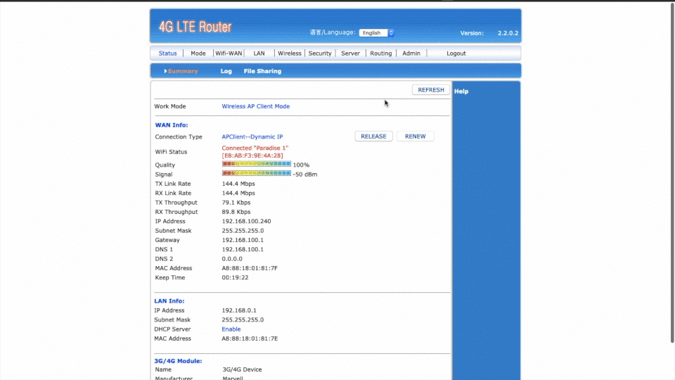
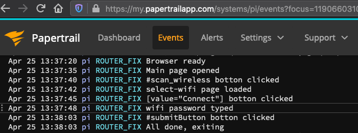

> One does not accumulate but eliminate. It is not daily increase but daily decrease. The height of cultivation always runs to simplicity.
>
> ― Bruce Lee

I've been a frequent traveller for the last few years and I learnt along the way that reducing the clutter that comes with me to the bare minimum is a *very good trend* to follow.

For example I drastically reduced the amount of clothes that I own to the point they all fit into a cabin luggage, and I'm generally mindful when I buy **any** new object because I know that either has to fit in my luggages or has to be sold/gifted/trashed next time I'll relocate.

I confess though that the geeky side of me still requires substantial room in the non-cabin luggage for the following:

- an old MacBook Air dated fall of 2013 (if I'm not wrong)
- Sennheiser Bluetooth headphones with noise cancellation (which of course I take to the cabin when boarding...)
- Sony PlayStation 3 *Super Slim* with one gamepad and a few original DVD games
- Raspberry Pi (armv6l)
- 1TB USB3 external 2.5" hard drive
- various Ethernet/USB/HDMI/miniJACK cables and plugs
- unbranded ADSL/4G/WiFi router, which runs a very crappy administrative software but once it's configured it does its job pretty well and comes with a few built-in handy features, like:

  - 4g/LTE connectivity
  - WiFi-to-WiFi bridging
  - persistent DHCP configurable table mapping (MAC <-> IP)
  - 4-ports Ethernet switch
  - etc.

## Nomad multimedia lounge setup

With the above items I'm able to very quickly setup a comfortable yet powerful gaming/media environment whenever I move into a new place where there's some connectivity (at least some mobile network coverage) and/or a TV color.

The only thing I have to do once settled in the new place is to bring power to router + Ps3 + Raspberry Pi, update the router configuration to connect in "bridge mode" to the available WiFi (or buy a SIM card with a LTE data plan if WiFi is not an option), plug both the Raspberry Pi (with the USB drive attached) and the PlayStation to the router switch with Ethernet cables, PlayStation to the TV with (hopefully) HDMI cable and... voilà!

Everything is connected to the Internet and ready to serve its purpose, including streaming media (Netflix/Amazon Prime/YouTube) and music (Spotify) directly from the relative PlayStation apps. For all that's not available online I make use of [Serviio media server][serviio], which lets me consume from the Playstation (via `DLNA` protocol) the audio/video/photo media files stored in the external USB hard drive.

Another side benefit I get with this setup is that with a single shot all my portable devices (MacBook, iPhone and Kindle) get Internet connectivity too: the router WiFi password is already saved and there's no need to configure yet another WiFi and type the relative password for each device.

## The Problem

One very annoying problem I face with this setup is that every single time there's a power outage and the router reboots, or for whatever other reason the WiFi bridge is broken, the router doesn't automatically reconnect to the source WiFi.

It might sound like something infrequent to you if you're used to live in developed countries but for example in east Africa, where I've been living the last few years, brief power outages are quite common even in the main urban areas.

In order to restore the bridge I have to manually log into the router admin interface from my laptop's browser, find the right admin web page from the unintuitive navigation bar, perform a few selects and clicks, retype the source WiFi password and, finally, click to apply and persist the configuration.



The above could be classified as a *first-world problem* indeed but, as you might already know if you've been following me for a while, I'm a long time advocate of the **lazy software engineer attitude** (our motto? life is short!): automate all the tedious and boring tasks so to be able to focus on the most important ones, those that are not so easy to automate and where I believe our true value as engineers is.

## The Solution

I was initially tempted to approach this using a tool I already know and use for some other projects ([Cypress][cypress]). Recently though I've been reading good things about [Google's Puppeteer][puppeteer] so I decided to take this chance to see what all the fuss is about.

This is the tech stack needed to implement the solution:

- a relatively old Raspberry Pi mounting Raspbian 10 (Buster)
- a Node.js runtime (in my case *v11.15.0* which is the last available version [officially distributed][nodejs-binaries] as binary that supports `armv6l` architecture)
- `puppeteer-core` *v3.0.0*
- Chromium browser *v78*
- Ansible *v2.9.6* (not strictly needed but that's how I drop things into my Raspberry Pi by default anyway)

[These 80 lines][code] of Node.js automate the above process thanks to the awesome [`puppeteer-core`][puppeteer-core] library. It runs both on MacOS and Linux:

- macOS: tested on my MacBook Air running Node.js *v13.13.0* and `puppeteer-core` *v3.0.0*
- Linux: tested on my Raspberry Pi `armv6l`, Node.js *v11.15.0* and `puppeteer-core` *v3.0.0*

To complete the setup, I add this simple cronjob that verifies connectivity every 2 minutes and, in case of failure, runs the Node.js script:

```bash
*/2 * * * * ping -nq -c 3 1.1.1.1 | grep -q " 100\% packet loss" && node /opt/routerfix/repo/fix-router.js 2>&1 | logger -t ROUTER_FIX
```

I split the above one liner command to better explain how it works:

1. `*/2 * * * *` tells `CRON` daemon to run the command every 2 minutes, it could have been run at 1 minute frequency but the Node.js script takes around 40 seconds to complete execution on my Raspberry Pi so this is meant as a safeguard to avoid running two processes at the same time. The script also commits suicide 90 seconds after execution anyway (refer to the `terminate` function [at line `17`][code-terminate] for more details) so this race condition should never happen
1. `ping -nq -c 3 1.1.1.1` sends 3 ICMP ECHO packets to a highly available IP destination (Cloudflare public DNS service), and in case these packets are all lost it will output to stdout something like "3 packets transmitted, 3 packets lost, 100% packet loss"
1. output from `ping` is piped to `grep`, the `-q` option suppress output and just returns 0 or non-zero exit code based on the string match. This means that the command after `&&` will be executed if and only if all the 3 ICMP packets are lost
1. `node /opt/routerfix/repo/fix-router.js 2>&1` executes the Node.js script which runs Chromium browser events in the background, it also combines stdin and stdout into a single stream (the `2>&1` bit)
1. by default, crontab commands output is sent to the *UNIX* user mailbox that owns the process; piping Node.js output to `logger -t ROUTER_FIX` sends it to the *syslog* service instead (which in my case is then eventually forwarded to [Papertrail][papertrail] where I can read them comfortably from my browser as you can see from the following screenshot)



You can find all the code involved in the solution in [this GitHub repository][code-repo] including the [Ansible playbook][ansible-tasks].

## Pitfalls and Caveats

You know when they say you never truly know anyone? that applies to software too:

- after ages of CRON usage I just discovered that the percentage char (`%`) has a special meaning in a crontab so needs to be properly escaped with a backslash char (`\`)
- in this pitfall I fell so many times that I think it's always a good idea to refresh our memories: CRON's `PATH` environment variable is usually not the same one of the default UNIX shell, so remember to either provide full path for each command or explicitly set it in the crontab (I opted for the latter solution as you can see [at line 58][ansible-tasks-path] of the Ansible playbook)

About Puppeteer, I barely scratched the surface of what the APIs offer so I can't say much about it beside that's well documented and easy to get started with. If you are already familiar with JavaScript and its callback-driven nature, Puppeteer should pose no real issue and you might be up and running in minutes.

Personally I find Cypress' promises-inspired style more elegant: chaining promises commands in one or more sequences is usually the way I use to think about interacting programmatically with the browser. As far as I understand they are targeting different users and use cases though so, as is usually the case, choose the right tool for the task, they're both solid projects anyway.

## Conclusion

The above automation has been active for the last few days and it's working like a charm, to the point I actually notice there's been an outage only when the microwave clock gets zeroed. I hope this simple example might help you in solving some more complex issue you're facing or give you some more ideas on how to approach it.

As usual, a reminder to not forget to drop a comment here below... and keep in mind the most important of things: life is short! ⚡

[ansible-tasks-path]: <https://github.com/shaftoe/router-wifi-bridge-reset/blob/0.1.0/ansible-tasks.yml#L58>
[ansible-tasks]: <https://github.com/shaftoe/router-wifi-bridge-reset/blob/0.1.0/ansible-tasks.yml>
[code-repo]: <https://github.com/shaftoe/router-wifi-bridge-reset/>
[code-terminate]: <https://github.com/shaftoe/router-wifi-bridge-reset/blob/0.1.0/fix-router.js#L17>
[code]: <https://github.com/shaftoe/router-wifi-bridge-reset/blob/0.1.0/fix-router.js>
[cypress]: <https://www.cypress.io/>
[nodejs-binaries]: <https://nodejs.org/dist/latest-v11.x/>
[papertrail]: <https://www.papertrail.com/>
[puppeteer-core]: <https://pptr.dev/#?show=api-puppeteer-vs-puppeteer-core>
[puppeteer-recorder]: <https://chrome.google.com/webstore/detail/puppeteer-recorder/djeegiggegleadkkbgopoonhjimgehda>
[puppeteer]: <https://pptr.dev/>
[serviio]: <https://serviio.org/>
[syslog-pipe]: <https://blog.adriaan.io/log-cronjob-output-to-syslog-in-ubuntu.html>
