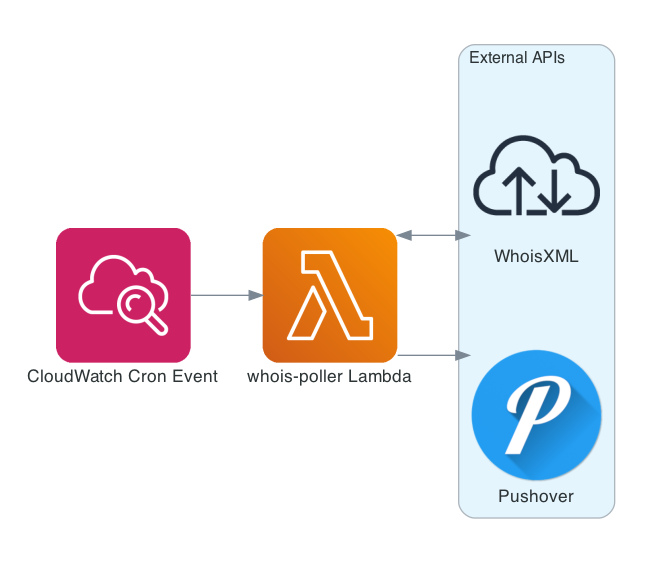
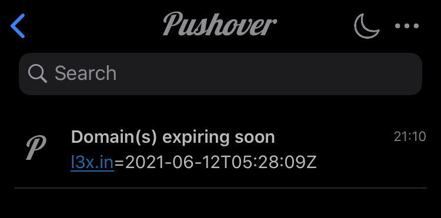

So it happened again: a few days ago I receive a (small, but still...) alert storm notifying me of service interruptions, the cause being something like `NO DOMAIN FOUND` so the culprit is pretty clear from the beginning.

I forgot to renew one of my domains that I thought I've asked the domain registrar to keep _auto-renewing_ for me, which apparently was not the case.

I confess this already happened to me in the past and thankfully this time the damage has not been as painful as it has been once, but still... these kind of disservices are probably the most frustrating ones because they are so... low-tech 😆

Anyway, hopefully this time I came up with a basic but resilient solution that should survive the test of time and I'm here going to talk about it.

## The problem

Basically every _Domain name Registrar_ offers some kind of _auto-renew_ feature to avoid unwanted domain expiration: you register a new domain name like `my-shiny-new-website.com`, you pay some money to the registrar to manage it for some set amount of time (usually being 1 year the smallest possible time span and something like 10 the biggest), and have the possibility to flag some _auto-renew_ checkbox to make it a recurring billing once the expiration time has come.

Even in the case you never forget to enable such an _auto-renew_ feature though you might still be hit by an unwanted expiry; for example the credit card you have once set as paying method has expired or has not enough credit left for the current billing period and the email from the registrar notifying you about it ends into the spam folder or is inadvertently ignored. Maybe unlikely, but still possible nevertheless.

You most definitely don't want that to happen without your knowledge. First of all you might lose ownership in case someone else registers it while it's expired; besides, it will most probably set in motion a catastrophic chain of events that might eventually disrupt all the services somehow connected to that domain, and in ways that you might not even have expected given that we very frequently take the existence and availability of the domain and DNS records as a given.

Ok, maybe that won't apply to DNS as some DevOps practitioner [might say](https://krisbuytaert.be/blog/)... but I digress.

Thankfully enough the expiry date for every domain name is public information and freely (and easily) accessible querying the WHOIS database. An excerpt from an example `whois` query run from my MacBook terminal:

```bash
$ whois l3x.in
% IANA WHOIS server
% for more information on IANA, visit http://www.iana.org
% This query returned 1 object

refer:        whois.registry.in
[cut..]
Domain Name: l3x.in
Registry Domain ID: D414400000004464209-IN
Registrar WHOIS Server:
Registrar URL: http://www.opensrs.com
Updated Date: 2020-06-18T05:16:26Z
Creation Date: 2017-06-12T05:28:09Z
Registry Expiry Date: 2021-06-12T05:28:09Z
[cut..]
```

The task is quite simple then: setup some monitoring to ensure that `Registry Expiry Date` is not too close to the current date; when the expiry day is getting close enough send an alert, and do so enough in advance for us to take action.

## The solution

Of course there are already many SaaS solutions that provide this kind of service, but they tend to be offered with a paid kind of subscription.

This is such a simple task though and the various _FaaS_ platforms like AWS Lambda are perfectly suited to deal with this kind of scenarios that I believe this is one case when it might make sense to develop this in house. Not to forget it's also good fun!

### APIs eat the World

Initially I thought to access the WHOIS database directly with some Python library (or via `subprocess` adding the `whois` binary to the execution environment via a Lambda Layer in the worse case), but than I thought _wait a second, I bet there are some APIs for that!_

And sure there are many. I had a quick look on what software is available today _as a Service_ to programmatically gather information from the WHOIS database and it turned out [WhoisXML API][whoisxmlapi] offering is just perfect for this task.

Their REST APIs are [easy to use][whoisxmlapi-docs] and the free subscription currently offers 500 queries per month which means that, if we run our new domain name expiration check daily like in my case, it can support checks for up to 16 domains.

### Show me some code

All we need is a way to trigger some code execution in a recurring way (_a la cron_), something that the integration between CloudWatch Events and Lambda offers natively and that's also very easy to set up with [a few lines of AWS CDK code][cdk-stack].

For this solution I've followed the same approach that I used for setting up the Lighthouse monitoring [I blogged about before][blog-lighthouse], with a few exceptions:

- no need for any client consumption: to send an alert message to my Pushover account directly from the Lambda (instead of via StatusCake service) is just fine
- no need for any caching nor state management, i.e. keep it simple and... **stateless**

The architecture is super simple and [the Lambda][cdk-lambda] fits in less than 80 lines of Python with no external imports beside `boto3`:



Here an example of how an alert looks like on my smartphone:



Currently I've configured it to send me an alert 14 days in advance, to be more precise to send one alert each morning after the deadline is over until either I renew the domain or somehow disable the alerting (e.g. with `cdk destroy`)

## Wrapping up

Once more developing a (basic but functional) serverless app on AWS with the help of CDK is very straightforward, is good fun and in some cases it is even free of charge!

To be honest almost every time I dig once more into _free tiers_ I'm amazed by how much you can accomplish nowadays just leveraging free (and powerful!) services.

Some might argue that the maintenance cost is non-zero and it might be true given that I still have to find a zero-maintenance kind of software project; going full serverless brings some benefits though, in this case for example it frees us from the burden of keeping the runtime up-to-date (unless we're using 3rd party libraries, then that burden is still on the developer for now), beside not having to worry about _cron daemons'_ health nor other common system administrator tasks.

More in general, using IaC tools like AWS CDK or Terraform (or both at the same time now thanks to [CDK for Terraform][cdk-for-terraform]!) has the side benefit of self-documenting what are all the resources that makes up the system infrastructure, hence making the project supposedly easier to grasp for the new developers.

For completeness I should mention that the above monitoring solution is not complete: if you want to ensure everything related with domain name resolution for your services is working properly you might want to setup some DNS monitoring for your records as well, not to forget monitoring the monitor health itself (in my case I read a CloudWatch error log daily email report, which I may blog about in the future).

As usual I'm eager to hear your thoughts, drop a message here or send me [a private message](/contact) if you prefer.

[blog-lighthouse]: <https://a.l3x.in/2020/05/30/add-pagespeed-check-with-serverless.html>
[cdk-for-terraform]: <https://www.hashicorp.com/blog/cdk-for-terraform-enabling-python-and-typescript-support/>
[cdk-lambda]: <https://github.com/shaftoe/api-l3x-in/blob/0.12.0/lib/stacks/whois_poller/lambdas/whois_poller.py#L34>
[cdk-stack]: <https://github.com/shaftoe/api-l3x-in/blob/0.12.0/lib/stacks/whois_poller/__init__.py>
[whoisxmlapi-docs]: <https://whois.whoisxmlapi.com/documentation/making-requests>
[whoisxmlapi]: <https://www.whoisxmlapi.com/>
