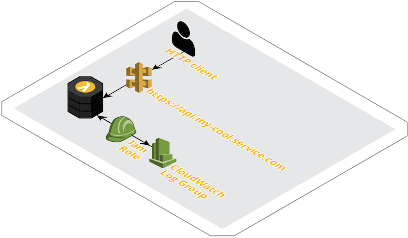

Since I discovered the main concepts and benefits of Serverless applications, I'm gradually migrating the few services I run on my personal server(s) towards solutions which require no need for me to keep any (virtual) server running. The reason is simple: there are so many other interesting things to do than keeping an online system in good shape. If that's not enough, leveraging FaaS (at least for very small workloads) usually brings cheaper bills compared to traditional hosting.

Even if there are quite a few nice tutorials available on how to setup common kind of Serverless projects, I can't remember one covering all the requirements I had. This time around it's also true, therefore I'll try to show here the steps I took for implementing and deploying a simple API backend using Python (v3.6), AWS Lambda, AWS API Gateway and Terraform. This simple diagram shows how the setup is supposed to look like:



The API backend [source code for our example][gh-main-page] is the simplest one could imagine, but it should be trivial to extend it to cover more complex cases. The API Gateway Lambda integration makes use of the relatively new _proxy feature_, which means all the HTTP requests hitting the gateway endpoint (except OPTIONS, intercepted by the Gateway for serving proper CORS headers) is forwarded to the Lambda _as is_, including path and method in the metadata, so the routing logic can be extended without changing any API Gateway configuration. 

Let's have a look at [the Python code in our example][gh-main-handler]: for each HTTP POST request to /contact_us, after some basic input sanitation, parse the body in search of some special attributes and, if the request is formatted as expected, send a message via the [Pushover][pushover] service:

```python
def lambda_handler(event, context):
    response = {
        "body": json.dumps({"message": ""}), # needs to be a valid JSON string.
        "headers": {
            "Access-Control-Allow-Origin": "*"
        },
        "statusCode": 405,
        "isBase64Encoded": False, # for binary support
    }

    path, method = event.get('path'), event.get('httpMethod')
    body = event.get('body')

    if not (path and method):
        msg = "Missing API Gateway event data"
        LOG.fatal(msg)
        response["body"] = json.dumps({"error": msg})
        return response

    LOG.info('Received HTTP %s request for path %s' % (method, path))

    if (path == '/contact_us' and method == 'POST'):
        response["body"], response["statusCode"] = contact_us(body)

    else:
        msg = '%s %s not allowed' % (method, path)
        response["statusCode"] = 405
        response["body"] = json.dumps({"error": msg})
        LOG.error(msg)

return response
```

NOTE: when using API Gateway Lambda proxy feautre, be careful to use the [proper response format][lambda-proxy-response] as shown above at line 2, otherwise you might step into errors hard to debug.

The `/contact_us` endpoint is currently used by a couple of HTML forms and It notifies me on my smartphone when there's any new submission, with no need for exposing my email address (or any other personal data) in the site HTML/JS code. I found a bunch of articles showing how to setup something very similar, but none fullfilling all my requirements. Here they are, in descending order of importance:

- the whole system is fully menaged (a.k.a. Serverless)
- limit the clicks needed for the setup at the bare minimum
- API endpoint is exposed as a vanity url with valid SSL certificate
- CORS setup should allow requests from any domain
- follow the *Principle of least privilege*, e.g. IAM permissions are set as tight as possible
- no resource usage surprises (e.g. no infinite expiration date for CloudWatch Logs)
- no Serverless frameworks needed
- low cost, possibly free of charge

I consider reproducible deployments a hard requirement when using cloud services: I don't want to wander around web consoles pointing and clicking to setup my services, it might be the right approach for prototyping but definitely not for deploying anything to be considered production ready.

I have nothing against the various Serverless frameworks out there, quite the contrary: they are definitely interesting tools fitting various needs, for example when I used AWS Chalice for another project I was quite happy with it, but for something as simple as an HTML form backend, the need for a framework feels like unnecessary overhead. There's another reason too: frameworks do a good job hiding part of the platform compexities, but at least this time around I want to have the best possible understanding of all the components involved. Not taking any shortcut, better known as _the hard way_, is in my experience one of the best ways to fully understand the tools I'm dealing with.

I also want to expose the endpoint making use of the domain name I registered in the past: something like `https://api.mycoolservice.com/` looks definitely more polished than `https://987654abcdef.cloudfront.net`, not to mention it's way easier to remember. To make use of our new REST API endpoint from any HTTP client we also need to add some [CORS configuration][cors-setup] which is also supported by API Gateway.

It's a bit surprising to find that proper management of AWS resources for Lamba is missing from most of the tutorials I’ve found. I'm referring specifically to CloudWatch Logs expiration (default is no expiration) and IAM permission (default is write permission to every LogGroup in the account). What I generally want is for logs older then one week to expire automatically, and to tighten the default IAM configuration for Lambda to reduce the attack surface . The setup will cover those parts too with just a couple of more Terraform resources. Maybe this Terraform snippet from `infra/lambda.tf` better explains what I mean:

```bash
# lambda.tf

# Configure log retention
resource "aws_cloudwatch_log_group" "lambda-api" {
  name              = "/aws/lambda/${replace("${var.domain_name}", ".", "-")}"
  retention_in_days = "${var.log_retention_in_days}"
}

# Restrict Lambda access to proper LogGroup
data "aws_iam_policy_document" "policy_for_lambda" {
  statement {
    actions = [
      "logs:CreateLogStream",
      "logs:PutLogEvents",
    ]

    resources = ["${aws_cloudwatch_log_group.lambda-api.arn}"]
  }
}
```

## Let's get started

From now on I’ll assume that you already have:

- registered a domain (`mycoolservice.com` in our example) and that you can add DNS records to it
- can read emails sent to `admin@mycoolservice.com` (or similar recipients, more details will follow)
- an AWS account with administrator rights
- installed Terraform v.0.11.7 (or higher) with its AWS provider v1.27.0 (or higher)
- installed aws-cli v1.15.53 (or higher)

Terraform will use your AWS aws-cli credentials to create the resources, so be careful to have `~/.aws/credentials` file properly setup (or whatever other configuration method you’re using for aws CLI, for example env variables if that’s what you’re using).

NOTE: later on you’ll need to edit a configuration file, `config.sh`, and one of the variables is called `$profile` and it contains the name of the aws-cli profile in said credentials file that Terraform will use, so you’ll be able to specify anything other then *default* if needed.

## First step: create an SSL certificate with AWS Certificate Manager

To begin with, we’ll need an SSL certificate fully managed by ACM. AWS will try to send you an email to a few addresses, like `admin@mycoolservice.com` (check out [the official documentation][aws-docs-acm-setup] for details) to be sure you own the domain. If you prefer, there’s also a DNS verification where you need to add some DNS record. Run this command to request an SSL cert for `api.mycoolservice.com` using email validation:

```bash
$ aws acm request-certificate --domain-name api.mycoolservice.com --validation-method EMAIL
{
    "CertificateArn": "arn:aws:acm:us-east-1:00000000000:certificate/484525fb-02e5-4b49-89ea-9b14f3abecf7"
}
```

At this point you should check your email from ACM and click on the verify link before proceeding.

## Clone the example code and add your configuration

I set up a GIT repository on GitHub with all that’s needed to setup this proof of concept, including the Python Lambda, the Terraform configuration and a simple deployment script. You should clone it in your working directory:

```bash
$ git clone https://github.com/shaftoe/api-gateway-lambda-example
$ cd serverless-api
```

In the `serverless-api` folder there’s an example configuration file:

```bash
├── LICENSE
├── README.md
├── config.sh.example
├── deploy.sh
├── infra
│   ├── api-gateway.tf
│   ├── lambda.tf
│   └── main.tf
├── src
│   └── lambda.py
```
  
Copy `config.sh.example` content into a new `config.sh` file and edit `config.sh` with your details. If you don’t have a [Pushover][pushover] account you can just leave the `$pushover*` variables empty (or unchanged, they are bogus anyway), the Lambda will fail without sending any push notification but you’ll still be able to test that everything else is working as expected.

Let's have a quick look at the Terraform files in the `infra/` folder.

```bash
# main.tf

variable "profile_name" {
  default = "default"
}

variable "region" {}

variable "domain_name" {}

variable "pushover_token" {}

variable "pushover_userkey" {}

variable "log_retention_in_days" {
  default = 7
}

provider "aws" {
  region  = "${var.region}"
  profile = "${var.profile_name}"
}

```

In `main.tf` there are all the variable declarations and the AWS provider. Having them we can pass those values at runtime with `-var name=value` in our deploy script. Nothing really interesting here. Things get a bit more complex for setting up the Lambda properly:

```bash
# lambda.tf

resource "aws_lambda_function" "api" {
  filename         = "lambda.zip"
  function_name    = "${replace("${var.domain_name}", ".", "-")}"
  role             = "${aws_iam_role.iam_for_lambda.arn}"
  handler          = "lambda.lambda_handler"
  source_code_hash = "${base64sha256(file("lambda.zip"))}"
  runtime          = "python3.6"

  environment {
    variables = {
      PUSHOVER_TOKEN   = "${var.pushover_token}"
      PUSHOVER_USERKEY = "${var.pushover_userkey}"
    }
  }
}

resource "aws_iam_role" "iam_for_lambda" {
  name = "${replace("${var.domain_name}", ".", "-")}-lambda"

  assume_role_policy = <<EOF
{
  "Version": "2012-10-17",
  "Statement": [
    {
      "Action": "sts:AssumeRole",
      "Principal": {
        "Service": "lambda.amazonaws.com"
      },
      "Effect": "Allow",
      "Sid": ""
    }
  ]
}
EOF
}

data "aws_iam_policy_document" "policy_for_lambda" {
  statement {
    actions = [
      "logs:CreateLogStream",
      "logs:PutLogEvents",
    ]

    resources = ["${aws_cloudwatch_log_group.lambda-api.arn}"]
  }
}

resource "aws_iam_role_policy" "policy_for_lambda" {
  name   = "${replace("${var.domain_name}", ".", "-")}-lambda"
  role   = "${aws_iam_role.iam_for_lambda.id}"
  policy = "${data.aws_iam_policy_document.policy_for_lambda.json}"
}

resource "aws_cloudwatch_log_group" "lambda-api" {
  name              = "/aws/lambda/${replace("${var.domain_name}", ".", "-")}"
  retention_in_days = "${var.log_retention_in_days}"
}


```

Beside the need to interpolate the `replace` function to avoid invalid characters when naming our AWS resources (_dot_ is not valid for Lambda names for example), it should be fairly readable. We obviously need a Lambda, a IAM role to associate with it, some IAM policies to specify what kind of privileges are needed, and a CloudWatch LogGroup to collect logs.

What's left is the most complex part which is setting up API Gateway. Thankfully, [Hashicorp published a good tutorial][hashicorp-tutorial] which I basically copied verbatim. I only had to add a couple of fixes required to make CORS work in my case and the few resources needed to link the SSL certificate and expose it with my domain name:

```bash
# api-gateway.tf

###############
# Enable CORS #
###############

# https://medium.com/@MrPonath/terraform-and-aws-api-gateway-a137ee48a8ac
resource "aws_api_gateway_method" "options_method" {
  rest_api_id   = "${aws_api_gateway_rest_api.lambda-api.id}"
  resource_id   = "${aws_api_gateway_resource.proxy.id}"
  http_method   = "OPTIONS"
  authorization = "NONE"
}

resource "aws_api_gateway_method_response" "options_200" {
  rest_api_id = "${aws_api_gateway_rest_api.lambda-api.id}"
  resource_id = "${aws_api_gateway_resource.proxy.id}"
  http_method = "${aws_api_gateway_method.options_method.http_method}"
  status_code = 200

  response_models {
    "application/json" = "Empty"
  }

  response_parameters {
    "method.response.header.Access-Control-Allow-Headers" = true
    "method.response.header.Access-Control-Allow-Methods" = true
    "method.response.header.Access-Control-Allow-Origin"  = true
  }
}

resource "aws_api_gateway_integration" "options_integration" {
  rest_api_id = "${aws_api_gateway_rest_api.lambda-api.id}"
  resource_id = "${aws_api_gateway_resource.proxy.id}"
  http_method = "${aws_api_gateway_method.options_method.http_method}"
  type        = "MOCK"

  # https://stackoverflow.com/questions/43990464/api-gateway-mock-integration-fails-with-500/44013347#44013347
  request_templates {
    "application/json" = <<EOF
{
  "statusCode": 200
}
EOF
  }
}

resource "aws_api_gateway_integration_response" "options_integration_response" {
  rest_api_id = "${aws_api_gateway_rest_api.lambda-api.id}"
  resource_id = "${aws_api_gateway_resource.proxy.id}"
  http_method = "${aws_api_gateway_method.options_method.http_method}"
  status_code = "${aws_api_gateway_method_response.options_200.status_code}"

  response_parameters = {
    "method.response.header.Access-Control-Allow-Headers" = "'Content-Type,X-Amz-Date,Authorization,X-Api-Key,X-Amz-Security-Token'"
    "method.response.header.Access-Control-Allow-Methods" = "'DELETE,GET,HEAD,OPTIONS,PATCH,POST,PUT'"
    "method.response.header.Access-Control-Allow-Origin"  = "'*'"
  }
}

#####################
# SSL custom domain #
#####################

data "aws_acm_certificate" "api" {
  domain = "${var.domain_name}"
}

resource "aws_api_gateway_domain_name" "api" {
  domain_name     = "${var.domain_name}"
  certificate_arn = "${data.aws_acm_certificate.api.arn}"
}

resource "aws_api_gateway_base_path_mapping" "api" {
  api_id      = "${aws_api_gateway_rest_api.lambda-api.id}"
  stage_name  = "${aws_api_gateway_deployment.lambda-api.stage_name}"
  domain_name = "${aws_api_gateway_domain_name.api.domain_name}"
}

```

## Deploy

At this point everything should be ready to be set up in AWS. You simply need to execute `build.sh` shell script:

```bash
$ chmod +x build.sh && ./build.sh
```

You'll be prompted by Terraform to type __yes__ to continue, that's your last chance for checking that everything shown by _Terraform plan_ looks as expected. If Terraform apply execution completes successfully, those new resources will be created in your AWS account:

- aws_api_gateway_base_path_mapping.api
- aws_api_gateway_deployment.lambda-api
- aws_api_gateway_domain_name.api
- aws_api_gateway_integration.lambda-api
- aws_api_gateway_integration.options_integration
- aws_api_gateway_integration_response.options_integration_response
- aws_api_gateway_method.options_method
- aws_api_gateway_method.proxy
- aws_api_gateway_method_response.options_200
- aws_api_gateway_resource.proxy
- aws_api_gateway_rest_api.lambda-api
- aws_cloudwatch_log_group.lambda-api
- aws_iam_role.iam_for_lambda
- aws_lambda_function.api

## Fourth step: add a CNAME to enable your vanity URL

If everything has been created successfully, you should be able to see something like this configured in API gateway:

```bash
$ aws apigateway get-domain-names
{
    "items": [
        {
            "certificateArn": "arn:aws:acm:us-east-1:000000000000:certificate/abcdefgh-12ab-4321-1234-5ccd5fe2a9a1",
            "distributionDomainName": "987654abcdef.cloudfront.net",
            "domainName": "api.mycoolservice.com",
            "endpointConfiguration": {
                "types": [
                    "EDGE"
                ]
            },
            "distributionHostedZoneId": "XXXXXXXXXXX",
            "certificateUploadDate": 1531751072
        }
    ]
}
```

NOTE: adding a custom domain to the CloudFront distribution linked to API Gateway will take some minutes (~20), so be patient if the above command doesn't show you what's expected right after Terraform execution has terminated.

The `distributionDomainName` value above is the one you need to add as a DNS record for your `api.mycoolservice.com` entry. To test that this step is complete, you could run for example this CLI command and search for a similar output:

```bash
$ dig +noall +answer -t CNAME api.mycoolservice.com
api.mycoolservice.com. 77 IN	CNAME	987654abcdef.cloudfront.net.
```

## Test your new API

If you reached this point everythings should be set and ready to be tested end to end! Terraform took care of everything, including:

- packaging the Lambda with the Python code and uploading it
- configuring API Gataway integration and CORS settings
- linking your custom domain to the API Gateway (Cloudfront) endpoint making use of the SSL certificate registered at the beginning of the process

Let's check with Curl that everything is actually in place and working as expected:

```bash
$ curl -X POST https://api.mycoolservice.com/contact_us
{"error": "JSON body is malformatted: the JSON object must be str, bytes or bytearray, not 'NoneType'"}

$ curl -X POST https://api.mycoolservice.com/bogus
{"error": "POST /bogus not allowed"}
```

CORS configuration should allow requests from any origin:

```bash
$ curl -I -X OPTIONS https://api.mycoolservice.com/contact_us
HTTP/2 200
[...]
content-type: application/json
content-length: 0
access-control-allow-origin: *
access-control-allow-headers: Content-Type,X-Amz-Date,Authorization,X-Api-Key,X-Amz-Security-Token
access-control-allow-methods: DELETE,GET,HEAD,OPTIONS,PATCH,POST,PUT
```

NOTE: we didn't create any setup for the root path (/), a request there will return a misleading message:

```bash
$ curl -X POST https://api.mycoolservice.com/
{"message":"Missing Authentication Token"}
```

## Deploy your own application

In this example we'be been using one of my personal project as template, but it's easy enough to replace the `src/lambda.py` code with your business logic, or even replace Python with one of the other supported runtimes (Node.js, Java, C# and Go).

API Gateway configuration should be now setup correctly without any need to be modified, so each new `deploy.sh` execution will only update the content of the Lambda resource with the code in `src/lambda.py`. You might also want to change the environment variables provided to the Lambda: to do that you need to edit both the Terraform code (i.e. `infra/main.tf` and `infra/lambda.tf`) and the `deploy.sh` script, and replace/extend with with your data accordingly:

```bash
# deploy.sh: add/remove -var lines:
[...]
terraform apply \
    -var "region=us-east-1" \
    -var "profile_name=${profile_name}" \
    -var "domain_name=${domain_name}" \
    -var "pushover_token=${pushover_token}" \
    -var "pushover_userkey=${pushover_userkey}" \
infra/


# infra/main.tf: add/remove variables
[...]
variable "pushover_token" {}

variable "pushover_userkey" {}


# infra/lambda.tf: add/remove environment variables
resource "aws_lambda_function" "api" {
[...]

  environment {
    variables = {
      PUSHOVER_TOKEN   = "${var.pushover_token}"
      PUSHOVER_USERKEY = "${var.pushover_userkey}"
    }
  }
}
```

## Bring your own source

This tutorial is completed, but you could go on and experiment some more with the setup just editing `src/lambda.py` and running `deploy.sh`, Terraform will notice the source file has changed and upload the new version.

```bash
$ git status
On branch master
Your branch is up to date with 'origin/master'.

Changes not staged for commit:
  (use "git add <file>..." to update what will be committed)
  (use "git checkout -- <file>..." to discard changes in working directory)

	modified:   src/lambda.py

$ ./deploy.sh
Cleaning up
Zipping lambda
  adding: lambda.py (deflated 62%)
aws_iam_role.iam_for_lambda: Refreshing state...
[...]

An execution plan has been generated and is shown below.
Resource actions are indicated with the following symbols:
  ~ update in-place

Terraform will perform the following actions:

  ~ aws_lambda_function.api
      last_modified:    "2018-07-16T20:26:09.631+0000" => <computed>
      source_code_hash: "7tNOk1t9fYABz0OArdcqMHUisSrMBSlY/oWEo7fMVn4=" => "D4+vAWzqZw7GowPcQrnlvyFAVi9yFIRXQdZS58xCQ4I="


Plan: 0 to add, 1 to change, 0 to destroy.

Do you want to perform these actions?
  Terraform will perform the actions described above.
  Only 'yes' will be accepted to approve.

  Enter a value: yes

aws_lambda_function.api: Modifying...
  last_modified:    "2018-07-16T20:26:09.631+0000" => "<computed>"
  source_code_hash: "7tNOk1t9fYABz0OArdcqMHUisSrMBSlY/oWEo7fMVn4=" => "D4+vAWzqZw7GowPcQrnlvyFAVi9yFIRXQdZS58xCQ4I="
aws_lambda_function.api: Modifications complete after 2s

Apply complete! Resources: 0 added, 1 changed, 0 destroyed.
```

This is an example of logs generated by a proper request, you can find them all in the CloudWatch Logs LogGroup `/aws/lambda/api-mycoolservice-com`:

```bash
START RequestId: e28d6aec-8c6e-11e8-bfed-3d0ef2ff5cc0 Version: $LATEST
[INFO] 2018-07-20T22:47:31.38Z e28d6aec-8c6e-11e8-bfed-3d0ef2ff5cc0 Received HTTP POST request for path /contact_us
[INFO] 2018-07-20T22:47:31.38Z e28d6aec-8c6e-11e8-bfed-3d0ef2ff5cc0 Processing payload
{
    "name": "test",
    "email": "test@me.com",
    "description": "hello world"
}

[INFO] 2018-07-20T22:47:31.38Z e28d6aec-8c6e-11e8-bfed-3d0ef2ff5cc0 Delivering message via Pushover
[INFO] 2018-07-20T22:47:31.422Z e28d6aec-8c6e-11e8-bfed-3d0ef2ff5cc0 Message delivered successfully
END RequestId: e28d6aec-8c6e-11e8-bfed-3d0ef2ff5cc0
REPORT RequestId: e28d6aec-8c6e-11e8-bfed-3d0ef2ff5cc0 Duration: 385.28 ms Billed Duration: 400 ms Memory Size: 128 MB Max Memory Used: 24 MB 
```

## Destroy all the things

When you're done experimenting, you might want to get rid of all the AWS resources we created so far. It's as easy as replacing _apply_ with _destroy_ in `deploy.sh`:

```bash
$ sed -i .orig 's/terraform apply/terraform destroy/g' deploy.sh

$ bash deploy.sh
[...]

An execution plan has been generated and is shown below.
Resource actions are indicated with the following symbols:
  - destroy

Terraform will perform the following actions:

  - aws_api_gateway_base_path_mapping.api

[...]

  - aws_lambda_permission.lambda_permission


Plan: 0 to add, 0 to change, 16 to destroy.

Do you really want to destroy?
  Terraform will destroy all your managed infrastructure, as shown above.
  There is no undo. Only 'yes' will be accepted to confirm.

  Enter a value: yes
```

## Conclusion

API Gateway Lambda proxy integration, together with Amazon Certificate Manager, makes it very cheap (basically free for small traffic loads) and easy to setup HTTP REST endpoints and expose them on our custom domains. Here I showed you how to put together all the needed scaffolding with Terraform and a few lines of Bash to have a basic _no clicks needed_ solution.

It should be easy to customize the example code and make this solution fit to more restrictive requirements, for example adding proper testing/staging/production lifecycles, monitoring, alerting, etc.

Please leave a comment for feedback or just ask for help if something is not clear or not working for you.

[cors-setup]: https://docs.aws.amazon.com/apigateway/latest/developerguide/how-to-cors.html
[pushover]: https://pushover.net/ "Pushover homepage"
[gh-main-page]: https://github.com/shaftoe/api-gateway-lambda-example/ "Example code"
[gh-main-handler]: https://github.com/shaftoe/api-gateway-lambda-example/blob/9e5e09b2e3b0d849fa7b7ac802dbdb8884edee7c/src/lambda.py#L65 "Python backend handler entry point"
[lambda-proxy-response]: https://docs.aws.amazon.com/apigateway/latest/developerguide/set-up-lambda-proxy-integrations.html#api-gateway-simple-proxy-for-lambda-output-format
[aws-docs-acm-setup]: https://docs.aws.amazon.com/acm/latest/userguide/gs-acm-validate-email.html
[hashicorp-tutorial]: https://www.terraform.io/docs/providers/aws/guides/serverless-with-aws-lambda-and-api-gateway.html
