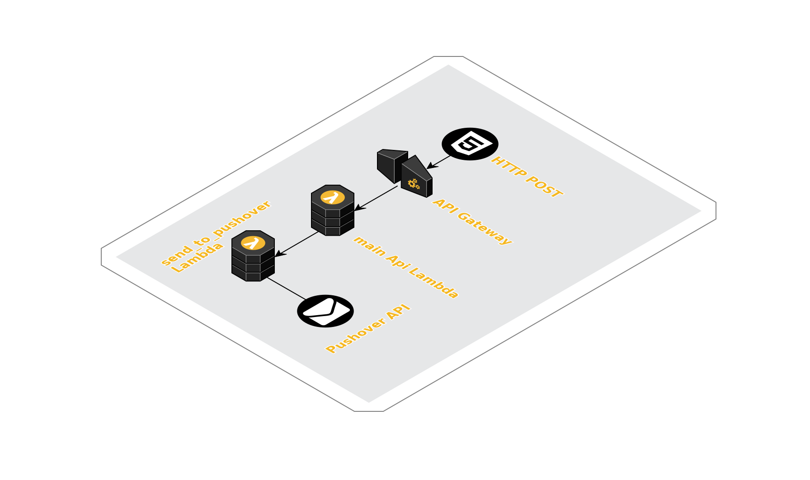

In this brief article I showcase one way to organize AWS resources in CDK _Stacks_ and make them general purpose and easily reusable.

More specifically, it is commonly accepted as a good practice in the _FaaS space_ to keep functions small and ideally single-purposed as much as possible.

In the actual case I'm presenting here I had a very simple Lambda _proxy_ function responsible for accepting HTTP requests proxied by API Gateway originated by a web client (some POST data from an actual HTML Form), validating the request and sending a push notification with the HTML form content to my iPhone using the [Pushover][pushover-site] notification service.

The initial Lambda code size was so small I didn't feel the need to split it nor make it more general purpose back in the time when I drafted the code. On top of that, the initial setup has been doing its job properly so far. But... now that [`api-l3x-in` project][api-l3x-in] is slowly but [inexorably growing][blog-1] in size and [functionalities][blog-2] it has come the time for some simple refactoring.

## Let's split

Here is the [initial version][src-old-main] of the main Lambda; as you can see at line 86 the entry point `handler` function is making use of some functionality from the [`utils`][src-handlers] library to:

1. parse the API Gateway `event` and `context` payloads
1. route the request found in the `event` payload to the `router` function at line 69

At this point the actual Lambda business logic takes place: if the HTTP request path matches the only implemented one (`POST /contact`), it executes the `contact` function at line 30 which constructs a message object that is eventually delivered to Pushover by `_send_msg_to_pushover` function at line 14.

The Lambda is not even 100 lines long so still easy to understand and reason about but that's not the point in this case: why not to make the notification service general to make use of it from wherever needed in the `api-l3x-in` (future) applications?

CDK makes adding this kind of functionality almost too easy and very little code addition is required as you can see in the [related commit][src-commit]. If we ignore the Lambda implementation details and focus only on the CDK changes required, it boils down to:

- for [the original `api`][src-api-diff] Stack:
  - a `lambda_notifications.grant_invoke(api_lambda)` line (at #34) that adds proper IAM `Invoke` permission
  - a new environment parameter (`LAMBDA_NOTIFICATIONS`) passed to the main api Lambda at line 31 that tells what's the notification Lambda to be invoked

- for the [new `notifications`][src-notif-diff] Stack:
  - a new Lambda exposed by the new `notifications` Stack (`self.pushover`) that we can pass around to our Stacks whenever needed

- for the [main CDK app][src-main-cdk]:
  - the new Stack declaration and the `self.pushover` object passing at line 50

This might have been made even more general using something like `self.main` as a name to completely abstract away the implemented notification service. Another addition might be the introduction of an SNS topic between the Lambda to send notifications in a _fan-out_ fashion for example. As usual, the sky (above _the Cloud_) is the limit.

## Architecture

The final layout looks like this:

## Conclusion

With this simple addition I hope I did manage to show one more time the power of simplicity that CDK brings when managing (both _serverless_ and more traditional kind of) applications based on AWS.

I also take the chance to recommend you a collection of curated resources available at the [Awesome CDK repository][awesome-cdk].

As always I'm eager to know what you think about the _pros_ and _cons_ of developing apps using AWS and _Cloud Development Kit_ and see how you make use of it (or hear if and how you're planning to). As more and more developers jump on the CDK bandwagon we should see more best practices and common patterns emerge making this kind of tasks even easier.

[api-l3x-in]:     <https://github.com/shaftoe/api-l3x-in/>
[awesome-cdk]:    <https://github.com/eladb/awesome-cdk>
[blog-1]:         <https://a.l3x.in/2020/02/04/migrating-from-terraform-to-cdk.html>
[blog-2]:         <https://a.l3x.in/2020/02/17/serverless-publish-to-multiple-social-media.html>
[pushover-site]:  <https://pushover.net/>
[src-api-diff]:   <https://github.com/shaftoe/api-l3x-in/commit/6ae64612ffcb7e4fb9fc03b789ee5e4785b14a3a#diff-d3e55fd58ad5556548d3d30d8bbc3c64>
[src-commit]:     <https://github.com/shaftoe/api-l3x-in/commit/6ae64612ffcb7e4fb9fc03b789ee5e4785b14a3a>
[src-handlers]:   <https://github.com/shaftoe/api-l3x-in/blob/0.2.0/src/utils/handlers.py>
[src-main-cdk]:   <https://github.com/shaftoe/api-l3x-in/commit/6ae64612ffcb7e4fb9fc03b789ee5e4785b14a3a#diff-e14e00167d0c916def47c93d80f0a501>
[src-notif-diff]: <https://github.com/shaftoe/api-l3x-in/commit/6ae64612ffcb7e4fb9fc03b789ee5e4785b14a3a#diff-e00746307e93a9d0526ae7715947d62f>
[src-old-main]:   <https://github.com/shaftoe/api-l3x-in/blob/0.2.0/src/stacks/api/api/main.py>
