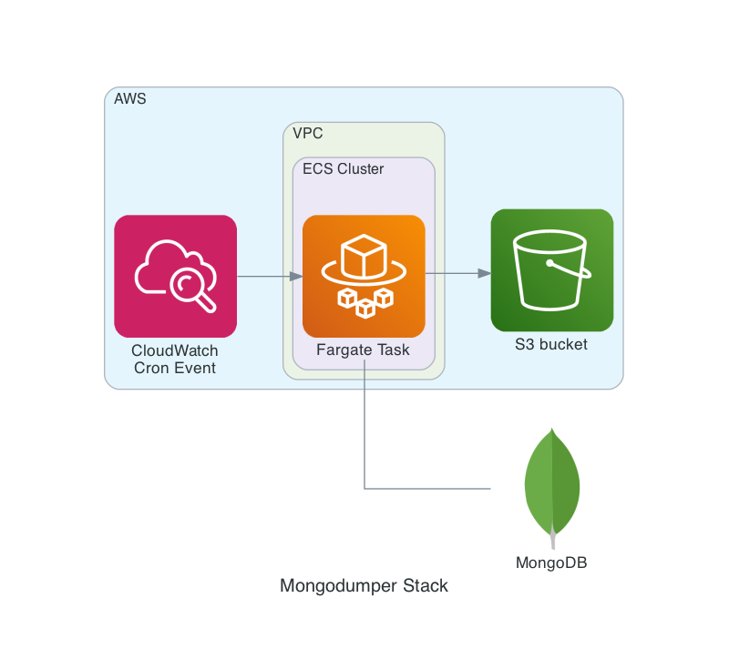

Even if I consider myself a Serverless fanboy I listen to all the arguments _against_ it and I have to agree some of them are valid. Heck, that's true for basically every technology: they all come with _pros_ and _cons_.

One of the most valuable benefits I see in Serverless and I believe hard to confute though is, well... that less toil work dedicated to server administration means that as an engineer you can focus on arguably more valuable tasks at hand and, probably, the end result of what you build will be a more robust and reliable infrastructure too.

Take this case for example: perform daily backups of remote (i.e. fully managed, no shell access) MongoDB instance, store these archives somewhere offsite and delete them once they are older than a defined amount of time. I'm sure if you've ever did system administration (or call it _DevOps_ if you prefer) this sounds like a very familiar kind of task, doesn't it?

## A conventional approach

In the old days, when Serverless was not yet a thing, a common way to approach this was to:

1. setup some _admin_ or _ops_ kind of server responsible for this and most probably other kind of similar back-office activities. No need to say you and your team also need to take good care of it for the forseeable future (i.e. have redundant storage drives in some kind of RAID scheme and replace them once they fail, keep the server itself backupped, monitor that it's up and running 24/7, etc)
1. set up some kind of cronjob to do the above backup routine every evening (or every X amount of time, depending on the needs, etc)
1. in the same above cronjob or as an independent task, have some kind of _pruning_ process that takes care of deleting old archives once their expiry date has passed

## A Serverless approach

Instead, in this article I'm going to show you how this very same problem might be approached from a Serverless perspective. These are the tools I'm going to use:

- AWS S3 for storing the archives and automatically prune them after they are older than 7 days
- AWS Fargate for executing a `mongodump` process (wrapped by a few lines of Bash) in a _Docker container_ and upload the generated archive to an S3 bucket
- AWS CloudWatch Events to trigger the routine in a _cron_ fashion (in my case every day at 23:50)
- AWS CDK to easily setup all the above, including ECS cluster and auto-generated _least-privilege_ IAM policies and so forth

## Show me the Code

This is a slightly simplified overview of the application:



The AWS CDK stack (including Dockerfile and Bash script) is [available on GitHub][cdk-stack]. I copy here the basic Bash script which is responsible for the actual work, all the rest is fairly simple [CDK plumbing][cdk-stack-main]:

```bash
#!/bin/bash
set -u
set -e
set -o pipefail

trap "{ printf 'ERROR: catched non-zero exit code\n'; exit 1; }" ERR

TODAY="$(date +%Y-%m-%d)"
DST_FILE="s3://${S3_BUCKET}/mongodump-${TODAY}.gz"

mongodump \
    --archive \
    --gzip \
    --ssl \
    --uri="${MONGODB_URI}" \
    | aws s3 cp - "${DST_FILE}"

printf "INFO: All done, exiting with code 0\n"
exit 0
```

The command pipe at line 11 should already suffice as `CMD` for Docker (i.e. there's no real need for a Bash wrapper to have it work) but in this way in case of failures I'm confident I'll get an `ERROR:` string in the relative CloudWatch Logs Group and I'll be notified about that.

For instance, I receive a daily email report with error logs present in every CloudWatch Log group and in my case I consider this enough as a form of monitoring but depending on your scenario you might want to setup some kind of specific monitoring for the S3 archive bucket.

You might want to also have a look at [this older article][blog-article] for hints and suggestions on how to develop a more detailed monitoring AWS-based solution.

## Pitfalls and Caveats

The above solution took little time to be developed and it's been working like a charm since it went into production. I list here the few pitfalls I stepped into during development and a few other recommendations:

- initially I used `alpine` as base Docker image but seems the shipped `mongodump` version doesn't work when `--ssl` option is enabled, at the time I'm writing this article it's easy to reproduce:

  ```sh
  docker run --rm -it alpine:latest
  apk add --quiet mongodb-tools
  export URI="mongodb://XXXXXXXXXXXXXXXXX@ds249233.mlab.com:49233/heroku_9pzlj109"
  mongodump --uri="${URI}"
  2020-08-07T08:33:19.705+0000 writing heroku_9pzlj109.records to
  2020-08-07T08:33:20.690+0000 done dumping heroku_9pzlj109.records (144 documents)
  2020-08-07T08:33:20.947+0000 writing heroku_9pzlj109.domains to
  2020-08-07T08:33:21.051+0000 writing heroku_9pzlj109.tokens to
  2020-08-07T08:33:21.487+0000 done dumping heroku_9pzlj109.domains (1 document)
  2020-08-07T08:33:21.632+0000 done dumping heroku_9pzlj109.tokens (1 document)
  mongodump --uri="${URI}" --ssl
  2020-08-07T08:34:02.318+0000 Failed: can't create session: could not connect to server: server selection error: server selection timeout,    current topology: { Type: Unknown, Servers: [{ Addr: ds249233.mlab.com:49233, Type: Unknown, State: Connected, Average RTT: 0 }, ] }
  ```

  I even tried to open a bug report on MongoDB official tracker but I couldn't manage to have a working account: I could sign up but I can't login, I even tried password resets with no luck... oh well, at least they can't tell me I haven't tried. By the way, I've worked around this using `debian:buster-slim` as Docker base image given that I don't care that much about image size anyway, my AWS bill is basically unaffected by a few more MBs stored in the ECS registry so what the heck
- every single time a Fargate task is executed without explicitly setting a security group **will create a brand new one** and, given that there's a quota of [maximum 2500 security groups per region][aws-sg-quota], this might very well cause a few headaches in the close future unless properly addressed. To avoid that I explicitly set the Fargate Task to use the default VPC security group which has open `EGRESS` rules and works fine in my scenario, it's implemented at at [line 66][cdk-stack-66] of the CDK stack. I believe this is a more sensible default behavior and I hope ECS developers will address this in the future, I bet some user might not be as lucky as I've been to notice it before deploying to production and discover it the hard way
- another annoying default setting in ECS: when running a Fargate Task in a public VPC subnet the container won't receive proper networking setup unless explicitly set, i.e. it will not be able to pull the image from the ECS registry, hence it will never reach the `RUNNING` stage and, even worse, no error log will be sent to CloudWatch Logs.

  Unfortunately CDK doesn't let you change this setting for CloudWatch Events yet, there's an [open feature request][cdk-feature-request] for that and given the recent speed of development in the CDK project I expect this to be solved soon.

  For the time being I worked around it manually changing the setting via the web console (yeah, I know,  _the horror_ 😱), another way around it that doesn't require manual intervention and makes the solution 100% _Infra as Code_ would have been to put a Lambda proxy between the CloudWatch Event and the Fargate task. It might be I've been either too lazy or too optimistic in CDK fixing this promptly, only time will tell
- currently the above solution supports storing archives for a single (MongoDB) database, it should be fairly trivial to extend it to support multiple databases though (e.g. defining multiple CloudWatch Events, each one setting different `MONGODB_URI` value via `container_overrides` parameter)
- for my simple need a _delete permanently after 7 days_ bucket lifecycle policy is all right, you might want to consider more complex policies like storing old archives to Glacier instead, S3 is [quite flexible][s3-lifecycles] in that regard

## Wrapping Up

Once more I'm delighted by how easy it is to work with CDK on AWS and I have the feeling those solutions I come up with are simple, robust, and basically require zero maintenance from my side (which is gold in itself).

Comparing the above solution to a more conventional approach which might require maintaining (and monitoring! and keeping secured! etc.) a server 24/7 for running actual work only for a few seconds per day is... wasteful, to say little.

Beside, I bet today there's no way to come up with a cheaper production-ready solution: a few seconds of Fargate execution per day won't even show up in the AWS monthly bill, and if it does it might be for just a few Euro (or Dollar) cents. Of course this might not be true in case of big datasets where the cost for S3 storage/data transfer might make an in-house solution (or even better, a fully managed solution, automated backups included) more cost effective, but I bet this is never going to be the case in many real scenarios where archives are relatively small sized (i.e. a few GBs or so).

That said, the current shortcomings in the integration between ECS and CDK are annoying and enforce the _Serverless is not 100% ready for production_ argument validity, at least for the time being.

I hope you enjoyed reading this article at least a fraction of how much I did while working on it, and don't forget to let me know what you think.

[aws-sg-quota]: <https://docs.aws.amazon.com/vpc/latest/userguide/amazon-vpc-limits.html>
[blog-article]: <https://a.l3x.in/blog/add-pagespeed-check-with-serverless/>
[cdk-feature-request]: <https://github.com/aws/aws-cdk/issues/9233>
[cdk-stack]: <https://github.com/shaftoe/api-l3x-in/tree/0.13.0/lib/stacks/mongodumper>
[cdk-stack-main]: <https://github.com/shaftoe/api-l3x-in/tree/0.13.0/lib/stacks/mongodumper/__init__.py>
[cdk-stack-66]: <https://github.com/shaftoe/api-l3x-in/tree/0.13.0/lib/stacks/mongodumper/__init__.py#L66>
[s3-lifecycles]: <https://docs.aws.amazon.com/AmazonS3/latest/dev/object-lifecycle-mgmt.html>
