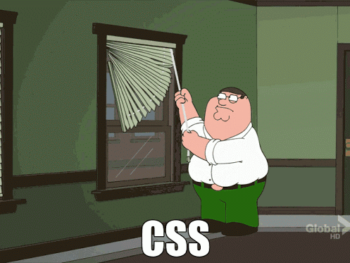

It's been a while since I last updated the blog, to the point I almost forgot where it was hosted...
The full story is that at some point in time I felt like to share some techical content which couldn't fit into a tweet.
I eventually landed on Tumblr, mainly because of the __native Markdown support__, but I was never really satisfied with it: I needed none of its social features, even less its ads, and I wanted to have a proper HTTPS URL not ending in `tumblr.com`.

Unfortunately I never invested much of my energies in web development, partly because the infrastructure side of the IT things always looked more intriguing to me, but also because of [that feeling][css-griffin-imgur] I got all the times I tried to add some style to even the simpliest of the web interfaces:

[][css-griffin-imgur]

Thanks to the good Coursera iOS application, and following the suggestion of a web developer and good friend of mine, I decided the time has come to learn a little bit of [Bootstrap][bootstrap-docs], and I have to admit it was easier and more fun that I expected. The [grid system][bootstrap-docs-grid] is quite ingenuous and having to deal with class properties instead of editing CSS content is making the whole experience much more enjoyable. The official Bootstrap documentation is quite good, and in parallel with [this Coursera course][bootstrap-course], it was easy enough to get started. If you are also thinking of getting started with Bootstrap I suggest you to have a look at it, it's free if all you want is to browse through the content without actually shooting for the exam certification.

A little Bootstrap alone is unfortunately not enough to avoid all the tedious tasks which come when the web site has something more then a single HTML page, hence I also took the chance to try out one of the [many OpenSource static site generators][static-gen-website] out there that are supposed to at least help reducing duplication. The choice is not easy given the amount of tools that flourished in that space, but I eventualy decided to settle for [Jekyll][jekyll-website] that seems to be the easiest pick:

- it's scoring first on [StaticGen website][static-gen-website]
- it's been around for a while, so I suppose it's decently stable
- it's surrounded by a wide community
- it's written in Ruby, which it's not new to me in case I need to do some debugging

So far I'm happy with the choice, [the documentation][jekyll-quickstart] is good enough for getting started quickly and the default setup is already giving me (almost) all I need to have a blog reachable at my custom domain, served via HTTPS, and free of charge. For the hosting part I initially planned to use AWS S3 + CloudFront, but thanks again to my friend, I got to know the [Google Firebase][firebase-website] free offer, which is just perfect for hosting small static websites, automate deployments, manage custom domains, SSL certificates, HTTP redirects, and so on.

The final result is what you see right now, I hope you like it! It's very basic, I like it that way and I don't have any plans to make it any fancier. Nevertheless I'll consider it a work in progress, more because I might decide to better understand how Jekyll works under the hood and test some of the possibilities it offers. Comments and feedback are welcome as always, so don't hold back if there's anything you'd like to say about it. You can also always [contact me privately]({{ site.url | absolute_url }}/contact.html) if you prefer.

[bootstrap-course]: https://www.coursera.org/learn/bootstrap-4
[static-gen-website]: https://www.staticgen.com/
[jekyll-website]: https://jekyllrb.com/
[jekyll-quickstart]: https://jekyllrb.com/docs/quickstart/
[bootstrap-docs]: https://getbootstrap.com/
[bootstrap-docs-grid]: https://getbootstrap.com/docs/4.1/layout/grid/
[firebase-website]: https://firebase.google.com/
[css-griffin-imgur]: https://imgur.com/gallery/Q3cUg29 "Click to open the animated gif"
