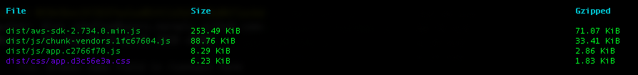

Vue is arguably one of the most interesting web framework out there and, even though the upcoming version 3 [is not ready yet](https://isvue3readyyet.com/), is currently in _release candidate_ state so all Vue developers are encouraged to try it out and help report any bug that might still be lurking there.

TL;DL: it's probably not ready for production but it might already make sense to use Vue 3 for internal and/or personal projects, for example using Vue v2 with backported features from v3, or in general to have some fun with v3 and play around with the new features... and enjoy the smaller build footprint it promises.

## Better (free) alternatives to Google

Personally I ditched most of Google services long ago, including the all-knowing, ads-infested and unfortunately ubiquitous GMail, in favor of services more respectful of our privacy, such as [Protonmail](https://www.protonmail.com/) for example.

For the records, this blog doesn't make use of Google Analytics but it's a topic for another article, you can find more details [in the privacy page](/privacy).

If you follow me you already know that if I can stay within the acceptable usage of a service while avoiding to paid for a premium subscription I'm more than happy to do so and it's [honestly quite amazing][blog-0] what you can [achieve nowadays][blog-1] just relying on [services' free tiers][blog-2].

Call me greedy if you like, I prefer to think it's the kind of attitude you develop after working many years in operations/devops teams where budgeting is one of the most important skills you need to develop in order to do a good job and help keeping the company away from bankruptcy.

## The itch to scratch

> "What has the above to do with Vue 3?"
>
> \- someone

Long story short, currently I don't need to send that many emails with a personal domain `From` address (i.e. ending in `@l3x.in` instead of `@protonmail.com`) from my workstation. Most of these are sent by some server or automated serverless process which I talked about [in a previous blog post][blog-3].

There's that occasional email though that I definitely want to send with my custom domain, for example to unsubscribe from a mailing list I previously subscribed to, and the automated process requires the MAIL_FROM: header to be the same used to subscribe, or maybe send it with from a different user, like `no-reply@my.domain`, and so on.

Sure, I could come up with simple wrapper around the AWS CLI tools for triggering the [Lambda `mailer` function][lambda-mailer] that I use for my automation tasks, but why not to have an handy web interface to do it any time I need it, regardless if I'm at the laptop or using my smartphone?

## vue-cli to the rescue

I'm already familiar with Vue and its features (vue-router, Vuex, etc.) but I've not used `vue-cli` yet to create and manage a project; this felt like the right chance to see how it helps in these kind of scenarios.

Disclaimer: to me *anything* that spares me the pain of working directly with Webpack is worth a try; I find Webpack's _developer experience_ truly abysmal and I look forward to that day when the frontend developer tool chain is cut by half at least and we won't need to deal with all those modern intricacies.

I'm happy to say [`vue-cli`](https://cli.vuejs.org/guide/) is well documented and takes care of that and other heavy lifting tasks required to develop and ship a viable reactive web application in 2020, starting from asking me if I want to play around with Vue3-beta (yes I do!) or go for a more stable version 2, spinning up a local development HTTP server (with hot reload), and so on.

## Show me the code

The project [source code](https://github.com/shaftoe/webmail) is available on GitHub, it's currently in _alpha_ stage considered its limited feature set (e.g. single user, ultra-basic authentication, no support for attachments yet. No, _missing support_ for HTML emails is definitely _a feature_).

That said, I'm already using the [up-to-date version](https://webmail.l3x.in/) deployed and hosted by dear Netlify and to be honest for an effort that took me slightly longer than one day I'm already happy with the result.

I'm arguably not making any use of any features that were not already available in Vue v2 (like the [new composition API](https://composition-api.vuejs.org/#summary) for example) but the bundle size looks small enough and I believe the developers when they say that's been an improvement there as well; in my case by the way the biggest spender is definitely the AWS SDK as you can see:

## Conclusion

I consciously kept the project simple and for my one-user use case it's already doing the job well enough. To be absolutely clear, it has no pretention to be an example of how to develop a good application with Vue 3, far from it. I just wanted to share my impressions on Vue 3, which are definitely good! I was also curious to see how long it takes to get up with an _MVP_ using `vue-cli` and I was actually pleased to see it took me very little time (...most of it spent in trying to understand how to hook `TailwindCSS` into the pipeline).

As already said I made arguably little use of the new Vue 3 features and for a simple webapp like this probably good old Vanilla JS was a good choice too... but personally I find it way easier (not to mention more fun!) to use a reactive frontend framework when I have to deal with user input data like in this case, so I'd definitely consider Vue 3 again next time I need to develop a simple application like this one, and probably at that time v3 will be considered stable anyway.

One of the features of `vue-cli` that merits a special mention is how easy it is to tweak Webpack configurations via `vue.config.js`, as you can better see in [the official documentation page](https://cli.vuejs.org/guide/webpack.html). In my case I made use of that to inject some environment variables and have them available at build time, like build timestamp for example. If you are curious you can see the [actual implementation here](https://github.com/shaftoe/webmail/blob/244563efcee3c2842b8941050c066fceb59c7909/vue.config.js#L4).

A final quick note on [TailwindCSS](https://tailwindcss.com/) too, which I chose to use just out of curiosity but I confess I haven't put much effort in learning about it and I was most probably better off writing some plain CSS: I shamefully copy-pasted snippets from the official docs to have something up and running just a bit above decency and in the fastest possible way... ignore that part if you'll have a look at the code, nothing interesting there (unless you're interested in _cargo cult_ coding, of course).

That's it for today, I hope this article gave you a good idea on how to get started with Vue 3, and don't forget to **let me know your thoughts**.

[blog-0]: https://a.l3x.in/blog/add-pagespeed-check-with-serverless/
[blog-1]: https://a.l3x.in/blog/free-whois-monitoring-with-serverless-on-aws/
[blog-2]: https://a.l3x.in/blog/mongodb-backups-with-aws-cdk/
[blog-3]: https://a.l3x.in/blog/centralise-linux-email-delivery/
[lambda-mailer]: https://github.com/shaftoe/api-l3x-in/blob/0.14.0/lib/stacks/notifications/lambdas/send_to_mailjet.py
