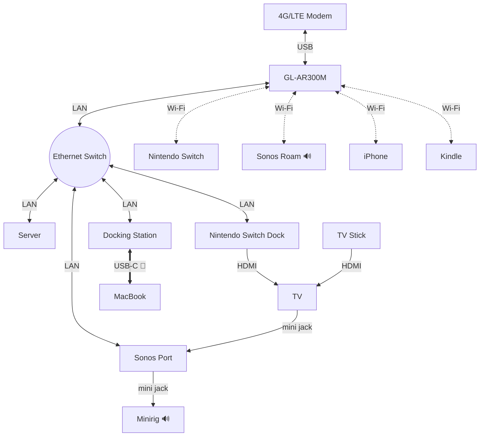

As far as my memory goes back I always loved to travel. In the last ~30 years I had the privilege to go through my fair share of intercontinental flights, changes of accommodation, and lived in different foreign countries for various years.

During this time I inevitably developed (and constantly refine) my own ideas of what comfort really is, built techniques and gathered technologies to try to recreate that sensation, that _warm fuzzy feeling_ I usually get while laying on my _real home's_[^11] couch, wherever I find myself to be.

Recently, after a relatively long while spent living surrounded by the many comforts of my own house in the Dominican Republic, I decided to visit South East Asia once more[^12] and I'm just now realising that I'm quite satisfied with this simple (ok, maybe not _that_ simple) geeky setup I came up with.

In this article I'll try to describe it in some details in the hope it might give you some good ideas too and, even better, that I might receive new interesting ones as feedback.  See the [`/contact`](/contact) page for how to get in touch with me.
## Comfortably dumb

Ideally I'd like to always be able to walk into any new house/apartment/hotel room I go by and, if I stay for more than just a few days, have all the digital goodies I'm used to there for me, preferably without having to setup a new (WiFi) connection for **each one** of the devices I own.

More precisely, I want to be able to automatically sync my files locally with Resilio Sync[^1], watch the occasional YouTube video, a movie or TV show episode streamed by my Plex Server, play a videogame on a TV screen, or listen to music and podcasts from various steaming services, all reproduced with decent audio fidelity[^2].
## Assumptions I make

- I'll have some way to connect to the public internet, either via Ethernet/Wifi lan provided by the place or some cellular 4-5G/LTE kind of (paid) service. Unless I'm planning to spend some days camping, on a sailing cruise or in some _very_ remote area, that's practically true all the time
- there'll be a TV or a monitor with at least one HDMI port. Usually there is one almost everywhere I go nowadays, in the worse case scenario I might decide to buy a second hand (or even new, they come as cheap as ~100USD) one if I plan to stay for a long enough period of time
- 110/220V A/C power outlets[^9]
## The Gear

This is an exhaustive (and admittedly a little exhausting to read) list of all the gear I have in my pockets or inside a luggage or backpack when I travel[^3]:

- Apple iPhone 16
- Apple Macbook Air M1 + bluetooth keyboard and touchpad
- [GL-AR300M](https://www.gl-inet.com/products/gl-ar300m)
- [Sonos Port](https://www.sonos.com/en-us/shop/port)
- [Sonos Roam](https://www.sonos.com/en-us/shop/roam-2 )[^4]
- [Sonos Ace](https://www.sonos.com/en-us/shop/sonos-ace-black)
- [Minirig 3](https://minirigs.co.uk/speakers/bluetooth-minirig-4)
- [Beelink EQ mini N200 16+500G](https://www.bee-link.com/products/beelink-eq-mini)
- [Anker Nano Docking station](https://www.anker.com/products/a83c3-13-in-1-docking-station-with-built-in-hub)
- [Amazon Fire TV stick](https://www.amazon.com/clp/B0DJGDC3BD) + remote control
- [Amazon Kindle Paperwhite 12th generation](https://www.amazon.com/clp/B0CFPJYX7P)
- [Nintendo Switch](https://www.nintendo.com/us/gaming-systems/switch/) + docking station + [pro controller](https://www.nintendo.com/us/store/products/pro-controller/)
- [Reloop Ready](https://www.reloop.com/reloop-ready) DJing console
- [Aveek mini audio mixer](https://www.amazon.com/Aveek-Channel-Mixer-Low-Noise-Sub-Mixing/dp/B0D872BVC3)
- unbranded 5 ports gigabit ethernet switch - e.g. <https://www.tp-link.com/us/business-networking/unmanaged-switch/tl-sg105/>
- unbranded USB LTE modem - e.g. <https://www.amazon.com/Portable-Router-300Mbps-Hotspot-Unlocked/dp/B0C79W8F52/>
- unbranded power bank with solar panel for (*very* slow) recharging option
- cords/adapters:
  - power adapters for each one of the above (some of which are just some sort of USB cable)
  - audio: 2x `mini-jack stereo to RCA` (for in + out of Sonos Port), 1x `RCA to RCA` (out of the Reloop Ready and into the Port, occasionally), and a few `mini-jack to jack` adapters
  - video: 2x `HDMI to HDMI`
  - network: 5x `Cat.6` ethernet patch cords
  - power/data: various `USB-[A|C] to USB-[A|C]` cords plus a `USB-C to Lightning` one to charge keyboard and touchpad

Macbook and iPhone are by far the most precious (and expensive) devices I own. I think I _could_ live without all the other pieces (albeit missing them dearly, of course) for a _reasonably long_ amount of time. I can't think of spending even a single day without Macbook and iPhone at reach anymore.

I'm supposed to be talking about comfort though so... let me show you how I actually make use of the listed gear to reach that sweet nerdy spot.
## Connect all the things 🔌

The following [Mermaid flowchart](https://mermaid.ai/open-source/syntax/flowchart.html) represents _more or less_[^5] how all the devices are interconnected:
****

It can actually get _a little_ more complicated then that if I drop the Aveek audio mixer into the picture, usually between the final speaker (e.g. Minirig) and other sources like Sonos Port, the Anker dock's sound card, the Reloop controller, and/or whatever else that could be plugged into a (mini) jack stereo port. Let's just say this is the _canonical_ setup that I usually settle for as a baseline.

Side note: Sonos devices connected to a single _system_ also join their own proprietary mesh network (_SonosNet_), adding that to the chart just seems to add confusion, I mention it here for completeness sake.
### Home is where WiFi auto joins

Despite its size the delightfully small `GL-AR300M` mini router (which I map in my `/etc/hosts` as `minirouter` for easy access) is probably the most important piece of all. It's an OpenWRT-based network router which gives me all the possible flexibility I could ask for when travelling.

To prove the point, once I got a hold on some kind of internet connection, I generally enter the new place and:

1. power `minirouter` up and wait a couple of minutes for it to boot
2. log into its admin web page and setup the WAN interface: if I have a wifi password I set it in repeater mode, if all I have is a mobile data plan I plug the LTE modem with the sim card in. If I'm in a rush I might just plug the iPhone in with an `USB-A to USB-C` cable and set the WAN router's interface in tethering mode

That's it! What takes longer is perhaps deciding where to place the device, the actual router setup is ~5 minutes, to be conservative.
### Audio routing

Perhaps you've been wondering: why the Sonos Port? is the component which looks the most at odds in a travel setup but I'll make here my stand: it's awesome!

Essentially it works as a flexible audio router and lets me dynamically define all sorts of input/output setups so I can for example:

- listen to what's the TV stick or the docked Switch is reproducing on both the Roam and the Minirig speakers simultaneously
- let a YT music podcast or a YT video concert play out on the Minirig, have the Roam come with me in the bathroom while I shower and listen to something else entirely
- plug in the DJing console as input and play a live set using both Roam and Minirig (or whatever other speaker I might have at hand) as speakers
- plug the laptop / docking station audio interface as input and use the speakers as output when e.g. I want to play music / recorded live sets from my hard drive
- setup a timer and let the music (or a sleeping inducing story) to turn off automatically
- normally I let myself wake up naturally but when I need to e.g. catch an early flight I find that waking up with (low but not too low) music is a somehow less unpleasant experience
- any Sonos system is easily extensible, so far I'm more than happy with what I have but adding more speakers in case is going to be trivial[^10]
## Wait but why?

The fact I can now use my LAN has various benefits beside that I don't need to ~~type~~ copy&paste passwords again and again. Perhaps most notably I can now connect seamlessly to my Sonos devices and the Amazon TV stick is ready with my Youtube Premium, Twitch and Plex TV accounts to stream media from my Beelink server. I also like to have my Resilio Sync main storage close by so not to have to transfer data outside the LAN for quickly backing up all my files including new photos, videos and what not.

Another perk is that I can use Wireguard[^6] out of the box to e.g. open an `ssh` session into the Beelink server without having to do anything specific, just turn on the Wireguard client on my carry-on device (iPhone/Macbook) when I'm not inside the LAN and target the private hostname. For the records, it works because the Beelink server connects at boot to an external Wireguard instance that acts as the central hub (star topology) and knows how to route network packets to private interfaces. To make it work I had to add a single persistent SNAT firewall rule for the GL-AR300M but this is out of scope for this article and I may decide to blog about that in the future[^7].

There's also a non-tech practical reason to bring it all with me: if I won't take this stuff with me it means I'll have to leave it... _somewhere_, either at home (which I might want to rent out), drop at some friend's place, sell or give away, and perhaps have to buy at least some of it down the road yet one more time. I realized that it's just easier for me to take *literally every piece of gear I own* with me and forget that there might be other options. I'm a computer nerd after all, remember? I don't own that many cloths anyway, there's usually plenty of room in the (big) luggage 🤓.
## Wrapping up

 And... the final and apparently necessary disclaimer: I _did_ ask my coding agent to write the initial draft of the Mermaid chart for me, because I'm lazy and, most notably, free inference[^8] is just too tempting not to be used. That said, I actually wrote every other single word in this article personally, manually typing them, without asking for help nor advise to anyone, LLM or humans alike. I don't know if we'll ever figure out a way to prove it so for now you gotta trust me on this, I guess.

And that's really all I had to share for today. Stay geeky, folks! ✌️

[^1]: Kind of like Dropbox, but self hosted: https://www.resilio.com/sync/

[^2]: That is: no TV nor laptop speakers involved, please do that to yourself too and never ever use these noise generators, at least plug in some bluetooth headphones instead...

[^3]: I always put **all devices with batteries** in the carry-on trolley or backpack that I take into the cabin whenever I fly. I strongly recommend you to always do the same

[^4]: Apparently the Roam v1 is not in production anymore, they _look_ exactly the same to me though

[^5]: Glossing over a few components like the TV stick remote control, Switch pro controller, audio mixer, keyboard, touchpad, etc.

[^6]: I hear good things about [Tailscale](https://tailscale.com/) services but I still prefer to setup my own networks

[^7]: Or not, given that there are plenty of well made tutorials for how to setup Wireguard successfully

[^8]: Today there are many options to obtain LLM inference for free, e.g. https://opencode.ai/go and https://openrouter.ai/ both offer free models regularly

[^9]: the more the merrier but always better to take a multiplier and an universal adapter

[^10]: I confess I'd love to be able to replace the Minirig with some kind of portable soundbar that connects to the TV via [Arc](https://www.ac3filter.net/what-does-arc-mean-on-tv/)... a device that Sonos will _never_ produce, unfortunately. Oh well, a tech addict gotta dream

[^11]: Whatever that really means is still a mystery to me

[^12]: In Hua Hin, Thailand, while writing this piece. Last time in SEA was almost exactly 10 years ago... time really flies
