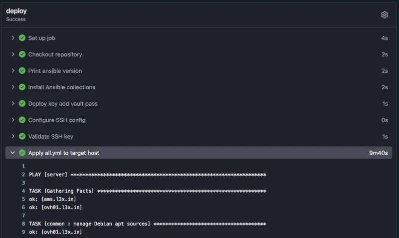

Like [many](https://ziglang.org/news/migrating-from-github-to-codeberg/) [others](https://mitchellh.com/writing/ghostty-leaving-github) [recently](https://www.reddit.com/r/TenacityAudio/comments/10xj8hh/latest_tenacity_developments/) I got fed up by what seems to be a steady and inexorable [degradation of GitHub](https://isgithubcooked.com/) quality of service (more on that later) and decided to walk down the *self host* path for all my things **Git, Docker, PRs and CI/CD**.

In this article I'm going to show you with some level of detail how my new self hosted **Forgejo**[^forgejo] setup currently looks like and how well it fits me as a near total replacement for GitHub (spoilers ahead: *very* well).

I'll provide links to actual repositories plus snippets of reusable configuration in case you might want to try it for yourself.

## Why Forgejo

To be honest I didn't spend much time selecting which OpenSource git forge to adopt.

I heard well about other options like [SourceHut](https://sourcehut.org/) for example BUT

- I already had a Codeberg (the company behind Forgejo development) account and I like [their mission](https://docs.codeberg.org/getting-started/what-is-codeberg/#our-mission)
- it exposes most of GitHub APIs verbatim so things like [GitHub actions should work](https://forgejo.org/docs/latest/user/actions/github-actions/) out of the box
- it's feature rich, considered stable and follows a regular release cycle
- the UI is almost identical to GitHub's
- it's written in Go, I like Go

Not exhaustive and much for an heuristic, I suppose, but has been enough for me.

## How it looks like

The forge is live at https://forge.l3x.in and is already home for a few of my OpenSource projects and all of my private repositories, with plans to migrate there most of the others I currently have on GitHub (more on that later).

Everything so far works pretty well: the web UI feels familiar and snappy, migrating / mirroring repos is just a click away, and CI/CD latency and build times are fantastic ⚡️ Just a quick comparison from a single project involving Docker (Podman) build to prove the point:

- on [GitHub](https://github.com/shaftoe/opengist/actions/runs/28580874938): 20m 54s
- on my [Forgejo Runner](https://forge.l3x.in/alex/opengist/actions/runs/8/jobs/0/attempt/1): 3m 19s

Almost 18 minutes saved for building (and pushing to registry) the very same application, not to mention from now on I won't have to wait for my turn in the GH build queue.

This win alone might have been worth the effort, I'll expand on what works better than on GitHub and what not later on but let's get into some technical details first.

## The Stack

A comprehensive list of the components making up my forge:

- a small [Debian Trixie](https://www.debian.org/releases/trixie/) `amd64` VPS to host all the things
- [Systemd](https://systemd.io/) and Podman [(Quadlets)](https://docs.podman.io/en/latest/markdown/podman-quadlet.1.html) to manage the services and recurring tasks
- [Caddy](https://caddyserver.com/) to terminate TLS requests and auto renew certificates
- Forgejo and [Forgejo runner](https://code.forgejo.org/forgejo/runner) for CI/CD
- [Webhook](https://github.com/adnanh/webhook) to restart services programmatically
- [Ansible](https://docs.ansible.com/projects/ansible/latest/index.html) and [OpenTofu](https://opentofu.org/) to configure *all the things* the *GitOps* way
- [Renovate](https://forge.l3x.in/alex/renovate-bot) to keep everything installed up to date
- [Restic](https://restic.readthedocs.io/en/latest/) to backup Podman volumes[^restic] daily
- [Axiom](https://registry.terraform.io/providers/axiomhq/axiom/latest/docs) (via [Vector](https://github.com/vectordotdev)) to collect Journald logs and alert on errors

### Virtual Private Server

I pay an annual subscription (~60€) to OVH[^ovh] in exchange for a dedicated Linux `amd64` VPS with 4 vCPUs cores, 8GB of ram, 75 GB of storage, plus one fixed IPv4 and one IPv6 address. It might not sound like much but you'd be surprised by how much something so low profile can still punch nowadays 🥊

Nothing fancy on the OS side either: I'm an old time Debian user and I already have a bunch of Ansible roles to setup on said VPS common services like SSHd, Postfix and so on; it comes natural to just drop another role for a new service whenever a new itch needs scratching.

What changed now thanks to having my personal Forgejo is *how* I run config management / IaC tools like Ansible and OpenTofu. More on that later.

### Service Managers

For this project I decided to teach myself some Podman, with me having been using Docker for all of my *containerize* history so far.

**TL;DR**: Docker Desktop is gone from my MacBook as **I now use Podman exclusively** for *all the things containers* both on my macOS workstation and Linux servers.

Contrary as with Docker, with Podman there's no need for any dedicated daemon process proxying commands and Quadlets work remarkably well in tandem with Systemd to run containerized services.

I now run all [Podman containers as *rootless*](https://github.com/podman-container-tools/podman/blob/main/docs/tutorials/rootless_tutorial.md) and once the service unit files are created I can for example start/stop/inspect services with the usual `systemctl` / `journalctl` commands you might be already familiar with.

Once services are enabled (`systemctl enable`), Systemd will take care of keeping them up and running after a host reboot, application crash, accidental `podman kill`, etc.

#### Example: manage Forgejo process

This is how the unit file for *Forgejo* looks like:

```bash
# ~/.config/containers/systemd/forgejo.container

[Container]
Image=codeberg.org/forgejo/forgejo:16
ContainerName=forgejo
Environment=USER_UID=1000
Environment=USER_GID=1000
Environment=FORGEJO____APP_NAME=Forgejo
[...]
Pull=newer
CgroupsMode=disabled
PublishPort=127.0.0.1:3000:3000
PublishPort=[::1]:3000:3000
PublishPort=2222:2222
Volume=forgejo-data:/data

[Service]
Restart=always

[Install]
WantedBy=default.target
```

The `Pull=newer` is there to ensure I'm always running an up-to-date Forgejo stable version (a daily timer backup script takes care of restarting the service, that's when the image pull kicks in).

This is how I can inspect service' status:

```bash
$ systemctl --user status forgejo.service
● forgejo.service
     Loaded: loaded (/home/podman/.config/containers/systemd/forgejo.container; generated)
     Active: active (running) since Sat 2026-07-18 00:00:43 UTC; 5h 24min ago
 Invocation: 2193250002a74867a80486adc9194134
   Main PID: 987445 (conmon)
      Tasks: 50 (limit: 9257)
     Memory: 530.5M (peak: 1G)
        CPU: 46min 14.351s
     CGroup: /user.slice/user-997.slice/user@997.service/app.slice/forgejo.service
```

To tail process' logs:

```bash
$ journalctl --user -u forgejo.service -f
Jul 18 05:44:23 ovh.l3x.in forgejo[987445]: 2026/07/18 05:44:23 ...eb/routing/logger.go:102:func1() [I] router: completed GET [...]
```

You might have noticed the `--user` flag for all the commands: that's required to interact with Systemd services not executed by *root*.

#### Podman own requirements

Actually I was ~~lying~~ not very accurate when listing the tools in use...

The stack isn't complete without at least[^packages] mentioning all the packages required by Podman to run properly, networking and all the rest.

This is the actual list of packages, straight from my `podman` Ansible role:

```yaml
podman_packages:
- podman
- uidmap    # UID mapping
- passt     # userland networking
- fuse      # filesystem
- aardvark  # DNS / discovery
- buildah   # image build
- crun      # runtime
```

I won't go into details on these to keep this article scope manageble, that said they are all OSS packages shipped with a modern Linux distribution so finding documentation is trivial, perhaps though referring directly to Podman [tutorials](https://docs.podman.io/en/latest/Tutorials.html) is all you need to get everything up and running as you see fit.

#### Recurring tasks

I use Systemd features as much as possible including custom [timers](https://wiki.archlinux.org/title/Systemd/Timers), a modern take on `cronjob`.

For example I run both Restic backups (see later section) and Podman prune tasks regularly, usually at daily frequency but that varies depending on the task.

An important one when running CI/CD jobs with Podman is to prune the various byproducts to avoid bloating the disk with unused waste; this *timer* does the trick:

```bash
# ~/.config/systemd/user/podman-prune.timer

[Unit]
Description=Periodic Podman system prune
Documentation=man:podman-system-prune(1)

[Timer]
OnCalendar=daily
Persistent=true

[Install]
WantedBy=timers.target
```

in tandem with the corresponding *service*:

```bash
# ~/.config/systemd/user/podman-prune.service

[Unit]
Description=Podman system prune (stopped containers, dangling images, unused networks, build cache)
Documentation=man:podman-system-prune(1)

[Service]
Type=oneshot
ExecStart=/usr/bin/podman system prune -f
```

Tip: `systemctl --user list-timers` to show all the timers defined for the logged in user:

```bash
$ systemctl --user list-timers "podman*"
NEXT                        LEFT LAST                              PASSED UNIT                     ACTIVATES
Tue 2026-07-21 00:00:00 UTC  18h Mon 2026-07-20 00:00:17 UTC 5h 14min ago podman-prune.timer       podman-prune.service
Tue 2026-07-21 00:09:17 UTC  18h Mon 2026-07-20 00:05:36 UTC  5h 8min ago podman-auto-update.timer podman-auto-update.service

2 timers listed.
```

 ### Reverse HTTP proxy

Not much to say about Caddy:

1. setup [APT sources](https://caddyserver.com/docs/install#debian-ubuntu-raspbian)
2. `apt-get install caddy`
3. add a `CNAME` DNS record to my domain for each new service, e.g. `forge CNAME <my VPS A record>`
4. drop one [Caddyfile](https://caddyserver.com/docs/caddyfile) for each reverse proxied service that I want to expose as HTTPS, e.g:
```bash
# /etc/caddy/conf.d/forge.caddy:
forge.l3x.in {
  reverse_proxy localhost:3000
}
```
  5. done

Boring! It was such a smooth transition away from Nginx and Certbot. Do yourself a favour and consider it too, I bet you won't regret it.

### Webhook

It comes handy to be able to interact with the hosting operating system from within the CI/CD environment, in my case from Forgejo runners jobs.

For this purpose I'm using https://github.com/adnanh/webhook and it's currently configured something like this:

```json
[
  {
    "id": "restart-gist",
    "execute-command": "/bin/sh",
    "pass-arguments-to-command": [
      { "source": "string", "name": "-c" },
      { "source": "string", "name": "sudo /usr/local/bin/podctl restart gist" }
    ],
    "include-command-output-in-response": false,
    "trigger-rule": {
      "match": {
        "type": "value",
        "parameter": { "source": "header", "name": "Authorization" },
        "value": "Bearer <redacted>"
      }
    }
  },
  ...
```

The above exposes a *UNIX* socket reachable from the Podman containers that accepts requests from the CI/CD jobs, in this particular case it restarts another Podman container (`gist`), you can see the actual workflow [here](https://forge.l3x.in/alex/opengist/src/commit/0792dc22800602d5e8cd60572654d42c00c82fbd/.forgejo/workflows/build-push-deploy.yml#L23) which uses [this reusable workflow](https://forge.l3x.in/alex/.profile/src/branch/master/.forgejo/workflows/webhook-restart.yml), all boiling down to a simple `curl` request:

```yaml
- name: Restart gist service
  run: |
    curl -s -o /dev/null --unix-socket /run/webhook/webhook.sock -H "Authorization: Bearer ${{ secrets.WEBHOOK_TOKEN }}" http://localhost/hooks/restart-gist
```

The actual webhook *process* is not running as `root` so `sudo` is used in the webhook *command* to allow the webhook *process* to restart services.  Sudo configuration at `/etc/sudoers.d/webhook` looks like this: 

```bash
webhook ALL=(root) NOPASSWD: /usr/local/bin/podctl restart
```

with `podctl` being a simple shell wrapper to run commands for the *podman* user (to avoid having to add `--user` to systemd commands and so on).

### Orchestrators

#### Ansible 

As already mentioned I use Ansible to configure the totality of services running on my personal Linux hosts.

I don't love the tool but I still have to find a decent replacement[^ansible-go]; once you have it in place though it's trivial to add a new role to install this and that and assign it to *host1* but not *host2*, and so on.

The forgejo `main.yaml` Ansible task list looks like this (comments and extra validation steps redacted to keep it short):

```yaml
- name: Deploy Caddy site fragment for Forgejo
  ansible.builtin.include_role:
    name: caddy
    tasks_from: site.yml
  vars:
    caddy_site_name: forge
    caddy_site_domain: "{{ forgejo_domain }}"
    caddy_site_proxy: localhost:3000

# -- Forgejo container --------------------------------------------------------

- name: Deploy Forgejo container
  ansible.builtin.include_role:
    name: podman
  vars:
    podman_quadlets: "{{ [forgejo_container_quadlet] }}"

- name: Admin user creation (skipped in check mode)
  when: not ansible_check_mode
  block:
    - name: List Forgejo users (idempotency check for admin creation)
      ansible.builtin.command:
        cmd: "{{ podman_helper_path }} podman exec --user 1000 forgejo gitea admin user list"
      register: _forgejo_users
      changed_when: false

    - name: Create the admin user (idempotent -- only if not yet present)
      ansible.builtin.command:
        argv:
          - "{{ podman_helper_path }}"
          - podman
          - exec
          - --user
          - "1000"
          - forgejo
          - gitea
          - admin
          - user
          - create
          - --admin
          - --username
          - "{{ forgejo_admin_user }}"
          - --password
          - "{{ forgejo_admin_password }}"
          - --email
          - "{{ forgejo_admin_email }}"
          - --must-change-password=false
      when: forgejo_admin_user not in _forgejo_users.stdout
      changed_when: true
      no_log: true

# -- Restic backup (only on hosts configured for backups) -------------------

- name: Restic backup for Forgejo (only on hosts configured for backups)
  when: (restic_repository | default('')) | length > 0
  block:
    - name: Ensure restic backup framework is installed (idempotent)
      ansible.builtin.include_role:
    name: restic

    - name: Register Forgejo restic backup job
      ansible.builtin.include_role:
        name: restic
        tasks_from: job.yml
      vars:
        restic_job_name: forgejo
        restic_job_command: >-
          /usr/local/bin/restic-backup forgejo --caddy
          --pre "podctl stop forgejo" --post "podctl start forgejo"
          -- {{ podman_user_home | default('/home/podman') }}/.local/share/containers/storage/volumes/forgejo-data/_data
```

My playbooks are supposed to be idempotent so a change to the `ansible` repository merged into `master` branch triggers a job that enforce the wanted state to all my hosts, more on that in the GitOps section below.

#### OpenTofu

For this specific project OpenTofu doesn't pull much weight but it plays its part so I'll briefly mention it too.

I keep [Tofu state files](https://forge.l3x.in/alex/terraform-state-bucket) for various projects in an AWS bucket and the AWS IAM role that's dedicated to edit the bucket [is assumed dynamically](https://forge.l3x.in/alex/terraform-state-bucket/src/commit/ff2849344c3446430a9e17100d9e8fc77c48add1/.forgejo/workflows/deploy.yaml#L51) thanks to the Forgejo's [OAuth2 provider](https://forgejo.org/docs/latest/user/oauth2-provider/).

One private repository with associated `tofu apply` job manages a few related resources like S3 backup buckets, Axiom datasets, and so on. Same as for Ansible, more details in the *GitOps* section below.

### Job Runner

The Forgejo action runner is deployed via Ansible as Podman rootless service like Forgejo, the nice extra is that it auto registers to the Forgejo instance at install time:

```yaml
- name: Runner registration (co-located, skipped in check mode)
  when: (not forgejo_runner_external) and (not ansible_check_mode)
  block:
    # generate-secret just emits a random 40-char hex; the forgejo container is
    # up and its DB reachable by this point (the instance play ran first).
    - name: Generate runner secret (first run only)
      ansible.builtin.command:
        cmd: "{{ podman_helper_path }} podman exec --user 1000 forgejo forgejo forgejo-cli actions generate-secret"
      register: _forgejo_runner_secret_gen
      changed_when: true
      no_log: true
      when: not _forgejo_runner_secret_file.stat.exists

    - name: Persist runner secret
      ansible.builtin.copy:
        dest: "{{ forgejo_runner_data_dir }}/.secret"
        content: "{{ _forgejo_runner_secret_gen.stdout | trim }}\n"
        owner: "{{ podman_user | default('podman') }}"
        group: "{{ podman_user | default('podman') }}"
        mode: "0600"
      no_log: true
      when: not _forgejo_runner_secret_file.stat.exists

    - name: Read runner secret
      ansible.builtin.slurp:
        src: "{{ forgejo_runner_data_dir }}/.secret"
      register: _forgejo_runner_secret_b64
      no_log: true

    - name: Set runner secret fact
      ansible.builtin.set_fact:
        _forgejo_runner_secret: "{{ (_forgejo_runner_secret_b64.content | b64decode) | trim }}"
      no_log: true

    # Idempotent server-side registration. --keep-labels so re-runs never clobber
    # the labels the runner advertises (from its config) on connect. Omitting
    # --scope makes it a global (instance-level) runner. changed_when false
    # because re-registering the same identity is a no-op by design.
    - name: Register runner with Forgejo (idempotent)
      ansible.builtin.command:
        cmd: >-
          {{ podman_helper_path }} podman exec --user 1000 forgejo
          forgejo forgejo-cli actions register
          --secret {{ _forgejo_runner_secret }}
          --name {{ forgejo_runner_name }}
          --keep-labels
      register: _forgejo_runner_register
      changed_when: false
      no_log: true
```

This works only when `forgejo_runner_external: false`,  external runners still need manual registration, it should also be possible to fully orchestrate registration for these but it's overkill for my use case so I didn't bother.

You can use whatever Docker images you like as base for the runner jobs and select them within workflows with `runs-on: <runner's label>` , now that I have a forge and a registry I can maintain my own `default` image with ease: https://forge.l3x.in/alex/runner-image.

This brings a few nice benefits including container boot time (the same Docker socket is used for running the CI/CD job AND building/pushing/pulling the runner image) and generally more efficient jobs given that all the tools I generally use in my workflows (AWS CLI, Go/Deno/NodeJS runtimes, etc.) are already installed.

### Renovate

My [Renovate bot](https://forge.l3x.in/alex/renovate-bot) repository is public, its [daily workflow](https://forge.l3x.in/alex/renovate-bot/src/branch/master/.forgejo/workflows/renovate.yml) takes care of auto-discovering every repository (owned by my user) in the forge and open pull requests accordingly. It also keeps a *Dependency Dashboard* issue for each project with the current state of the bot affairs and actionable points (rebase this PR, rebase them all, etc) for each managed repository.

Renovate takes care of bumping package and image versions pinned in Ansible roles, OpenTofu config, and even container images like [the one](https://forge.l3x.in/alex/runner-image) run by the Forgejo runner itself.

### Backup manager

I'm a simple man:

- Restic has a nice UX
- Restic is written in Go
- I like a nice UX and, as you already guessed, I like Go

OVH Cloud offers S3 compatible object storage and I use that (as well as [Scaleway's](https://www.scaleway.com/en/object-storage/)) as Restic backups backend.

The config file at `/etc/restic/restic.env` looks something like this:

```bash
# Ansible-managed -- restic repository environment (loaded by systemd units)
RESTIC_REPOSITORY=s3:https://s3.eu-west-par.io.cloud.ovh.net/<my bucket>
RESTIC_PASSWORD_FILE=/etc/restic/password
AWS_ACCESS_KEY_ID=< ... >
AWS_SECRET_ACCESS_KEY=< ... >
RESTIC_FORGET_ARGS=--keep-daily 7 --keep-weekly 4 --keep-monthly 6 --keep-yearly 1
```

Example of Restic CLI usage:

```bash
$ restic snapshots --tag forgejo --latest 1
enter password for repository:
repository 005f1217 opened (version 2, compression level auto)
ID        Time                 Host          Tags        Paths                                                                    Size
-------------------------------------------------------------------------------------------------------------------------------------------
a6e93185  2026-07-20 03:00:28  ovh.l3x.in  forgejo     /home/podman/.local/share/containers/storage/volumes/forgejo-data/_data  3.783 GiB
-------------------------------------------------------------------------------------------------------------------------------------------
Timestamps shown in local time
1 snapshots
```

The actual backup scripts run as *timers* and are very simple `restic` wrappers responsible for stopping/starting services while extracting data from the related Podman volumes.

### Log Collector

I use Vector to forward *journald* logs to an Axiom `server-logs` dataset, which is also provisioned via OpenTofu:

```hcl
resource "axiom_dataset" "server_logs" {
  name        = var.axiom_dataset
  description = "Server logs and metrics"
}

resource "axiom_notifier" "default" {
  name = "Default"
  properties = {
    email = {
      emails = [var.axiom_notification_email]
    }
  }
}
```

This is an area I still have to work on though: services like Axiom are incredibly powerful but the learning curve for how to make the best out of your data is arguably steep.

For now I'm simply dumping everything collected by *journald* there (their *free tier* is pretty generous) and getting alerted every hour if the number of error logs is above a certain threshold, better than nothing but lots of room for improvement.

## The GitOps way

As already mentioned above, all the config management / IaC repositories are now hosted on the forge. To apply *any* changes to the host and/or its services I now do the following:

1. I open a PR in the related repo
2. once ready, I rebase/squash it to `master`; it might require a few iteration with the collaboration of [my coding agent](https://forge.l3x.in/alex/.profile/src/branch/master/.forgejo/workflows/pi.yml), potentially all driven via specific comments to the issue and/or PR involved
3. a specific `apply` workflow is triggered, either `ansible-playbook` or `tofu apply`
4. I wait for the *apply* processes to complete (jobs failures result in email notifications)

That's it! Of course I can still apply the same changes from my personal computer if needed, for example when I'm prototyping something, but I'm relying more and more on the full automated GitOps flow and I've got to say I quite like the self contained nature of it.

For a starter it's easier to troubleshoot failures when logs are stored as job run's so I can e.g. share them to a collaborator, point a coding agent to them, or simply save the run link in an issue and come back to that task later, download and read/search them locally, and so on.



Probably though what I like best is the simplicity of the workflow that comes with it: any approved code change automatically results in an actual applied change and I can prepare and make such modifications wherever I am (that is, from my mobile's browser too).

## Security assessment

As you might have already noticed so far, I've put *quite some trust* in Forgejo.

Only time will tell if I'm right about this but I tend to believe it's easier to keep that safe compared to my workstation. A few thoughts on the matter:

- only trusted people can have an account on the forge, no pull request can get merged without my supervision
- CI/CD tasks run as a simple linux user process with limited blast radius. I know one shouldn't rely on containers alone for isolation, it's probably more than good enough for something like a nobody's private forge though
- if any successful exploit to Codeberg/Forgejo is found it will be patched timely
- everything of interest happening on the host is traceable thanks to *journald* streaming logs to Axiom, I can't say the same for my macbook
- differently from my personal computer, the host doesn't store at least any AWS secret thanks to OIDC, not possible (yet) for all the cloud services I use but hopefully they'll catch up eventually
- I follow least-privilege principle when minting other tokens and creating IAM-like roles
- thanks to Renovate and CI/CD workflows literally all the software running on the host is as up to date as it could be, this alone won't save me from e.g. supply chain attacks but afaik it's still good practice to keep up with the latest patches

I acknowledge the worse case scenario (e.g. angry ex girlfriend exfiltrating all my precious secrets out of my Forgejo's user account) is bad. I could for example go more in depth and expose the forge only on the [Wireguard](https://www.wireguard.com/) interface already present on the host BUT part of the reason I have a forge is collaboration so that won't do.

Ultimately, at least for now, I accept the trade-off: we can't have anything 100% secure anyway and comfort in life is important too. Security is also a process: I'll keep working on this setup to find the best balance for my needs, following best practices as well as I can and as soon as they are consolidated.

For now I put my trust in the stack I chose and especially in Forgejo developers to do a good job, so far I have all the reasons to believe they are worthy my trust. You might want to consider adopting a stronger security stance if your scenario is different. I can't prove it but personally I believe these secrets are now safer in Forgejo hands than GitHub's anyway but you might want to consider adopting a stronger security stance if your scenario is different.

## Big Wins

I list here some of what I feel like big improvements I gained so far, in random order of importance:

 - I don't depend anymore on GitHub abysmal uptime/QoS to be able to work on my stuff
 - one small thing I like the most is that defining action secrets for my account once is all I need to have them available to all my projects, no more need to copy over action secrets, which is a moderate PITA I have to suffer with GitHub. This also means I can create [default shareable workflows](https://forge.l3x.in/alex/.profile/src/branch/master/.forgejo/workflows) in a template repo to have them work out of the box for new projects
 - unlimited private repos with unlimited CI/CD minutes and unlimited possibility of collaboration (I can host as many users as I want and give them RW without paying GH fees)
 - shorter build times and always up to date build image
 - I don't have to trust GH anymore in keeping my precious secrets safe
 - I now have a personal container image registry and hosting a new HTTPS/TLS service is almost trivial, I actually have to hold the urge to hammer every new itch into it 🔨
 - I've acquired new powers 💪 e.g. keeping mirrors from GH, build and publish packages for [the most common platforms](https://forgejo.org/docs/latest/user/packages/), and I bet more that I still have to learn

## Pitfalls, gotchas and limitations

 - getting *rootless* Podman right is non trivial, e.g. I spent some unexpected extra amount of time understanding and tweaking Pasta to my needs, but it was worth it
 - I have a super cheap (thanks to Scaleway) IPv6 only host and I'm using it as secondary job runner but the current global state of IPv6 adoption is bad. See my GitHub rant section below for example
 - GitHub ecosystem is huge and the amount of projects depending on it is staggering, it also means that many useful integrations like [NPM trusted publishing](https://github.blog/changelog/2025-07-31-npm-trusted-publishing-with-oidc-is-generally-available/) and GitHub applications (in my case Codecov's and Netlify's) are not available when migrating to Codeberg/Forgejo
 - differently from GitHub, every actions workflow needs an `enable-email-notifications: true` or it won't send any notification in case of failures, personally I want them enabled all the time so I'd rather have it opt-out by default
 - I try to enforce least privilege for containers too but e.g. read only is not always possible. Snippet from the related Ansible role:
```yaml
 podman_quadlet_container_defaults:
	DropCapability: all
	NoNewPrivileges: true
	ReadOnly: true
```

Unfortunately for now it is not feasible for me to move *all* projects out of GH and not only because of technical reasons:

- as already mentioned above, there's no NPM trusted publishing support yet for Forgejo and I make use of it to publish [a few packages](https://www.npmjs.com/~alexanderfortin?activeTab=packages)
- no integrations with [Codecov](https://about.codecov.io/) and Netlify means I lose some of the cool features they offer when integrating via GH, for example getting Netlify's *[Deploy Previews](https://www.netlify.com/platform/core/deploy-previews/)* for this very website for each new PR I open
- almost all the network/social effect is lost: no GH stars, no users forking and providing patches and/or discussing issues, reporting bugs, and so on. It's a pretty big deal and I guess that's a big reason many others are not abandoning GitHub for alternatives like Codeberg, [Tangled](https://tangled.org/), and so on, even when equally fed up by GitHub depressing state

## A special mention for the GitHub depressing state of affairs

I don't even know where to start from... so I start with my final thought: I don't *hate* GitHub, it's been inspiring (albeit that feeling is long gone) and instrumental to my SWE career and personal enjoyment of learning how to build software, I never paid GH a single cent to make use of its many services and it's still a relatively good vehicle for collaboration on projects I care about.

 That said, I lost all the hope of any greatness for it since Microsoft's acquisition, I just wish it will eventually loose the central role it has covered for OSS development so far 
 
My hope is that federation between all code forges will be the default method of code collaboration, similarly to how I hope something like *ATproto*[^atproto] to be the de-facto backbone for social network interactions.

[Many others](https://www.iankduncan.com/engineering/2026-02-05-github-actions-killing-your-team/) have discussed better than me what's wrong with GitHub today. I don't even get started with how GH Actions have been neglected, but let me vent out at least about this small and almost invisible bit:

```bash
$ host -t AAAA github.com
github.com has no AAAA record

$ host -t AAAA ghcr.io
ghcr.io has no AAAA record
```

If find their lack of IPv6 support... ~~disturbing~~ embarrassing. It might not affect you directly but to me it speaks volumes about what the priorities are for one of the most successful and resourceful tech companies in the world[^copilot].

## AI assistance disclaimer

Working on my personal projects I make heavy use of LLM coding assistance, I also develop and maintain this [Pi coding agent action](https://forge.l3x.in/alex/pi-coding-agent-action) and I have it enabled for all my Forgejo and GitHub projects, that's also something I might blog about eventually.

That said, I wrote every single word of this post (and all the others before this) without any AI aid with the only exception of [Obsidian](https://obsidian.md/)'s auto correction (English is not my first language so I bet it shows in my writing...) and I'd be sad to know my articles get automatically marked as *slop* and therefore ignored, and that not because the (lack of) merits of their content.

If you want to know more on my thoughts and tooling around AI you can visit the [/ai](/ai/) slash page[^slashpages] on this very website.

## Final notes

It's been a long while since the last blog post and finally I have found something (hopefully) interesting to show! Or better said, I found the will to put the effort into writing about it.

I find it much easier to build than to show and this is  good exercise for me to share what I do and, tangentially, do it in a way that makes it possible to share.

I'm not sure yet I'll stick to a predictable cadence but I'll definitely try to write more frequently; I've experimented writing this article with Obsidian apps (macOS/iOS) and it's been a surprisingly good experience so I have at least some good reasons to hope.

Keep forging! ✌️

[^forgejo]: Forgejo v16 [just released](https://forgejo.org/2026-07-release-v16-0/)
[^slashpages]: See https://slashpages.net/ for more about slash pages and the Indie Web
[^restic]: I use Restic to backup various other data sources like Postgres database dumps but that's out of scope for this article
[^ovh]: I feel like recommending OVH as service provider if you want cheap but reliable cloud resources from an European company with datacenters [in Europe (and elsewhere)](https://corporate.ovhcloud.com/en/company/)
[^ansible-go]: has anyone been successful yet with "LLM: let's rewrite Ansible in Go, do not do mistakes" kind of prompt? Let me know!
[^atproto]: I recently moved from Mastodon to [Bluesky](https://bsky.app/profile/l3x.in/post/3mpgefohuls2t) and I host my own PDS at https://social.l3x.in 
[^copilot]: "just choke `copilot` down every possible throat" seems to be their current business strategy
[^packages]: I'm also glossing over other core components like e.g. DNS records and SMTP relaying, I consider them to be out of scope for this article
